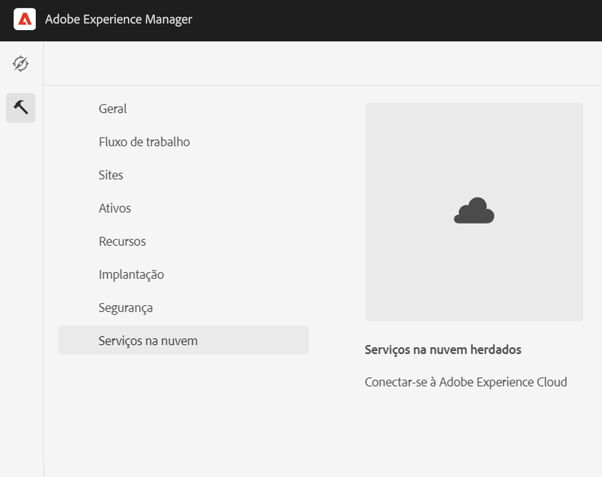
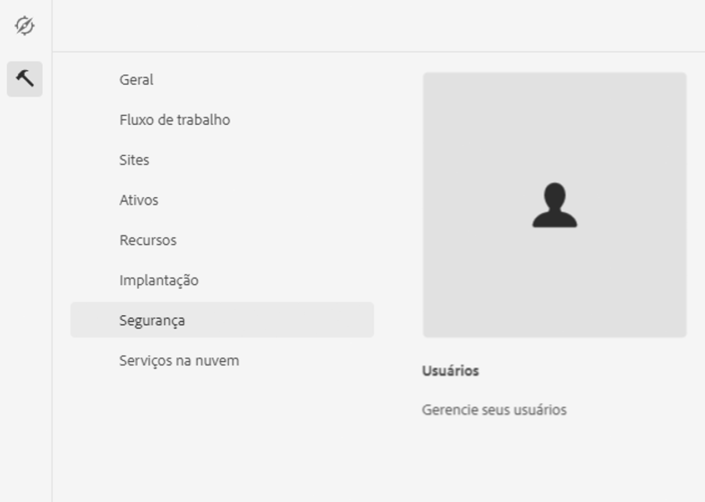

# Integração com o Adobe Campaign Classic {#integrating-campaign-classic}

Por meio da integração com o Adobe Campaign, é possível gerenciar a entrega de e-mails, conteúdo e formulários diretamente AEM as a Cloud Service. As etapas de configuração no Adobe Campaign Classic e no AEM as a Cloud Service são necessárias para permitir a comunicação bidirecional entre as soluções.

Observe que AEM as a Cloud Service e Adobe Campaign Classic também podem ser usados de forma independente. Por exemplo, os profissionais de marketing podem criar campanhas e usar o direcionamento no Adobe Campaign, enquanto os criadores de conteúdo podem trabalhar no design AEM as a Cloud Service.

## Fluxo de trabalho de integração {#integration-workflow}

Os capítulos a seguir detalham como integrar as soluções. Isso requer etapas de configuração no Adobe Campaign Classic e AEM as a Cloud Service. Assim, você aprenderá a:

* [Criar o usuário operador](#create-operator)
* [Configurar AEM as a Cloud Service para a integração](#aem-configuration)
* [Configurar o usuário remoto do Campaign](#configure-user)
* [Configurar a conta externa do Adobe Campaign Classic](#acc-setup)

### Pré-requisitos {#prerequisites}

**Adobe Campaign Classic**

Para executar a integração, você precisa de uma instância do Adobe Campaign Classic em funcionamento, incluindo um banco de dados. Se precisar de detalhes adicionais sobre como configurar e configurar o Adobe Campaign Classic, leia o documento oficial [Documentação do Adobe Campaign Classic](https://experienceleague.adobe.com/docs/campaign-classic/using/campaign-classic-home.html) especialmente o guia Instalação e configuração. Lembre-se de que para executar as operações apresentadas abaixo, você também precisa ter a função de administrador.

**AEM as a Cloud Service**

Você precisa do [AEM as a Cloud Service](https://experienceleague.adobe.com/docs/experience-manager-cloud-service/content/overview/introduction.html) solução.

### Criação do usuário Operador no Adobe Campaign Classic {#create-operator}

Abra o console do cliente do Adobe Campaign Classic no menu Iniciar e faça logon. A página inicial deve ser exibida.

1. Clique em **Explorer** para abrir a visualização do Explorer.
   
1. Na visualização em árvore, à esquerda, navegue até **Administração->Gerenciamento de acesso->Operadores**.
1. Clique duas vezes no `aemserver` na lista Operadores à direita.
1. Alterne para **Editar** guia . Defina a senha do servidor aemserver.
   
1. Clique no botão **Direitos de acesso** e clique na guia **Editar os parâmetros de acesso** sob as configurações de segurança.
1. Em Encryption, selecione Public network como a zona de conexão autorizada. Clique em **OK**.
   
1. Clique em **Salvar**.
1. Faça logoff.
1. Vá para o local de instalação do Adobe Campaign Classic v7, por exemplo `C:\Program Files\Adobe\Adobe Campaign Classic v7\conf` e abra o `serverConf.xml` como administrador.
   * Procurar por **zona de segurança**.
   * Defina os seguintes parâmetros `allowHTTP="true"` `sessionTokenOnly="true"` `allowUserPassword="true"`.
   * Salve o arquivo.
1. Certifique-se de que a zona de segurança não seja substituída pela respectiva configuração em `config-<server name>.xml` arquivo (C:\Program Files\Adobe\Adobe Campaign Classic v7\conf\config_acc-test.xml).
   * Se o arquivo de configuração contiver uma configuração de zona de segurança separada, altere a `allowUserPassword` para verdadeiro.
1. Se quiser alterar a porta do servidor Adobe Campaign Classic, substitua 8080 pela porta desejada (por exemplo: 80).

>[!NOTE]
>
>Por padrão, não há zona de segurança configurada para o operador. Para se conectar ao Adobe Campaign com AEM as a Cloud Service, é necessário selecionar um (consulte as etapas acima). É altamente recomendável criar uma zona de segurança dedicada ao AEM para evitar problemas de segurança.

### Configuração do AEM as a Cloud Service {#aem-configuration}

1. Faça logon no cloud manager e inicie a instância AEM as a Cloud Service do autor.
1. Ir para **Ferramentas Cloud Service Cloud Service Legacy**.
   
1. Role para baixo até Adobe Campaign e clique no botão **Configurar agora** link .
   * Insira um título.
   * Insira um nome.
   * Clique em **Criar**.
1. Na tela Editar componente
   * Insira o nome de usuário, consulte [Criar o usuário operador](#create-operator).
   * Digite a senha.
   * Insira o ponto final da API do servidor do Adobe Campaign Classic (por exemplo, `http://3.22625.51:80`).
   * Clique em **Conectar-se ao Adobe Campaign**.
   * Clique em **OK**.

   >[!NOTE]
   >
   >Certifique-se de que o servidor Adobe Campaign esteja acessível na Internet porque AEM as a Cloud Service não pode acessar redes privadas.
1. Verifique a instância de publicação na configuração do Link Externalizer.
Você pode visualizar essa configuração verificando o despejo de status dos serviços OSGi no [console do desenvolvedor](https://experienceleague.adobe.com/docs/experience-manager-learn/cloud-service/debugging/debugging-aem-as-a-cloud-service/developer-console.html#osgi-services).
Se não estiver correto, faça alterações no repositório Git da instância correspondente e implante a configuração usando [gerenciador de nuvem](https://experienceleague.adobe.com/docs/experience-manager-cloud-service/content/implementing/using-cloud-manager/deploy-code.html).

```
Service 3310 - [com.day.cq.commons.Externalizer] (pid: com.day.cq.commons.impl.ExternalizerImpl)",
"  from Bundle 420 - Day Communique 5 Commons Library (com.day.cq.cq-commons), version 5.12.16",
"    component.id: 2149",
"    component.name: com.day.cq.commons.impl.ExternalizerImpl",
"    externalizer.contextpath: ",
"    externalizer.domains: [local https://author-p17558-e33255-cmstg.adobeaemcloud.com, author https://author-p17558-e33255-cmstg.adobeaemcloud.com,
     publish https://publish-p17558-e33255-cmstg.adobeaemcloud.com]",
"    externalizer.encodedpath: false",
"    externalizer.host: ",
"    feature-origins: [com.day.cq:cq-quickstart:slingosgifeature:cq-platform-model_quickstart_author:6.6.0-V23085]",
"    service.bundleid: 420",
"    service.description: Creates absolute URLs",
"    service.scope: bundle",
"    service.vendor: Adobe Systems Incorporated",
```

>[!NOTE]
>
>A instância de publicação também deve estar acessível no servidor do Adobe Campaign.

### Configurar o usuário remoto do Adobe Campaign {#configure-user}

Você precisa definir uma senha para o usuário remoto da campanha. É necessário para conectar o Adobe Campaign Classic com o AEM as a Cloud Service.

1. Ir para **AEM-Ferramentas-Usuários De Segurança**.
   
1. Procure a variável `campaign-remote` e clique nele.
1. Clique em Alterar senha
   * Digite a nova senha duas vezes.
   * Digite sua senha do AEM.
   * Clique em **Salvar**.

### Configuração da conta externa do Adobe Campaign Classic {#acc-setup}

Você também deve configurar uma conta externa para conectar o Adobe Campaign Classic à instância as a Cloud Service AEM.

1. Faça logon no servidor do Adobe Campaign Classic usando o console do cliente.
1. Vá para a Visualização do Explorer.
1. Na visualização de árvore à esquerda, vá para **Contas Externas Da Administration-Platform**.
1. Na exibição de lista na parte superior direita, clique em AEM instância.
1. Na configuração da instância de AEM
   * Insira AEM IP/FQN do autor as a Cloud Service, por exemplo `https://author-p17558-e33255-cmstg.adobeaemcloud.com`.
   * Insira o usuário e a conta.
   * Insira a senha do usuário remoto da campanha definida na instância as a Cloud Service AEM (consulte o procedimento acima).
   * Selecione o **Ativado** caixa de seleção.
   * Clique em **Salvar**.

   >[!NOTE]
   >
   >O IP/FQN do servidor de Autores do AEM deve estar acessível a partir da instância do servidor do Adobe Campaign Classic. Além disso, não adicione o caractere de barra invertida no IP/FQN do servidor de Autores do AEM.

Após configurar o Adobe Campaign Classic e AEM as a Cloud Service, a integração agora é concluída. Além disso, você também pode aprender a criar um informativo do Adobe Experience Manager lendo [esta página](/help/sites-cloud/integrating/creating-newsletter.md).
