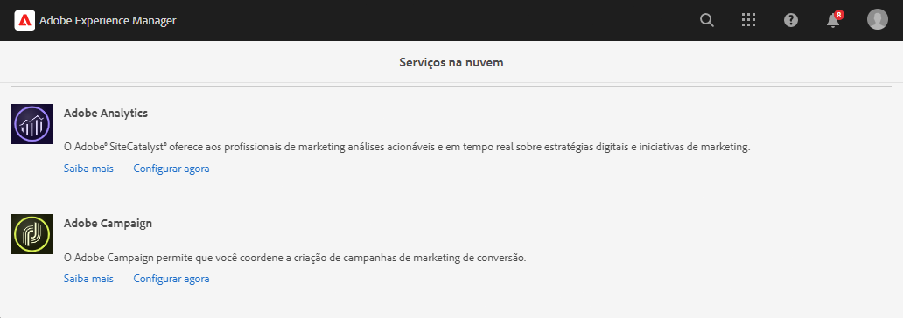
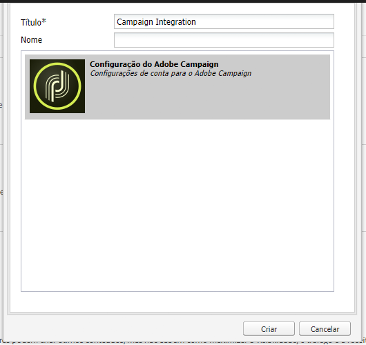
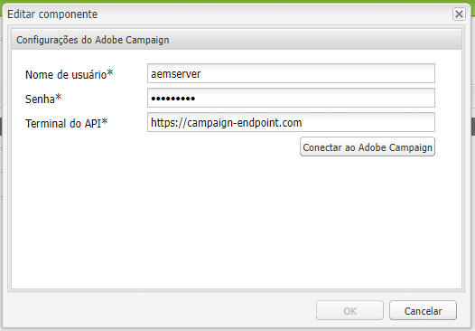

# Integração com o Adobe Campaign Classic {#integrating-campaign-classic}

Ao integrar AEM as a Cloud Service com o Adobe Campaign, você pode gerenciar a entrega de e-mails, conteúdo e formulários diretamente AEM as a Cloud Service. As etapas de configuração no Adobe Campaign Classic e no AEM as a Cloud Service são necessárias para permitir a comunicação bidirecional entre as soluções.

Essa integração permite que AEM as a Cloud Service e Adobe Campaign Classic sejam usados de forma independente. Os profissionais de marketing podem criar campanhas e usar a definição de metas no Adobe Campaign, enquanto os criadores de conteúdo podem trabalhar em paralelo no design de conteúdo AEM as a Cloud Service. A integração permite que o conteúdo e o design da campanha no AEM sejam direcionados e entregues pelo Campaign.

## Etapas de integração {#integration-steps}

A integração entre o AEM e o Campaign requer várias etapas em ambas as soluções.

1. [Instale o Pacote de integração de AEM no Campaign.](#install-package)
1. [Criar um operador para AEM no Campaign](#create-operator)
1. [Configurar a integração do Campaign no AEM](#campaign-integration)
1. [Configurar o AEM Externalizador](#externalizer)
1. [Configure o usuário remoto de campanha no AEM](#configure-user)
1. [Configuração da conta externa AEM no Campaign](#acc-setup)

Este documento aborda detalhadamente cada uma dessas etapas

## Pré-requisitos {#prerequisites}

* Acesso de administrador ao Adobe Campaign Classic
   * Para executar a integração, é necessário ter uma instância do Adobe Campaign Classic em funcionamento, incluindo um banco de dados configurado.
   * Se você precisar de detalhes adicionais sobre como configurar e configurar o Adobe Campaign Classic, consulte o [documentação da Adobe Campaign Classic,](https://experienceleague.adobe.com/docs/campaign-classic/using/campaign-classic-home.html) particularmente o guia Instalação e configuração.

* Acesso do administrador AEM as a Cloud Service

## Instalação do pacote de integração de AEM no Campaign {#install-package}

O **Integração de AEM** no Adobe Campaign inclui várias configurações padrão necessárias para se conectar ao AEM.

1. Como administrador, faça logon na instância do Adobe Campaign usando o console do cliente.

1. Selecionar **Ferramentas** > **Avançado** > **Importar pacote...**.

   

1. Clique em **Instale um pacote padrão** e, em seguida, clique em **Próximo**.

1. Verifique a **Integração de AEM** pacote.

   

1. Clique em **Próximo** e depois **Iniciar** para iniciar a instalação.

   

1. Clique em **Fechar** quando a instalação for concluída.

O pacote de integração agora está instalado.

## Criação do operador para AEM no Campaign {#create-operator}

O pacote de integração cria automaticamente o `aemserver` operador que AEM usa para se conectar ao Adobe Campaign. Você deve definir uma zona de segurança para esse operador e definir sua senha.

1. Faça logon no Adobe Campaign como administrador usando o console do cliente.

1. Selecionar **Ferramentas** -> **Explorer** na barra de menus.

1. No explorador, navegue até o **Administração** > **Gerenciamento de acesso** > **Operadores** nó .

1. Selecione o `aemserver` operador.

1. No **Editar** do operador, selecione o **Direitos de acesso** subguia e clique no botão **Editar os parâmetros de acesso...** link .

   

1. Selecione a zona de segurança apropriada e defina a máscara IP confiável conforme necessário.

1. Clique em **Salvar**.

1. Faça logoff do cliente do Adobe Campaign.

1. No sistema de arquivos do servidor Adobe Campaign, navegue até o local de instalação do Campaign e edite o `serverConf.xml` como administrador. Normalmente, esse arquivo está localizado em:
   * `C:\Program Files\Adobe\Adobe Campaign Classic v7\conf` no Windows.
   * `/usr/local/neolane/nl6/conf/eng` no Linux.

1. Procurar por `securityZone` e certifique-se de que os seguintes parâmetros estejam definidos para a zona de segurança do operador de AEM.

   * `allowHTTP="true"`
   * `sessionTokenOnly="true"`
   * `allowUserPassword="true"`.

1. Salve o arquivo.

1. Certifique-se de que a zona de segurança não seja substituída pela respectiva configuração no `config-<server name>.xml` arquivo.

   * Se o arquivo de configuração contiver uma configuração de zona de segurança separada, altere a `allowUserPassword` para `true`.

1. Se quiser alterar a porta do servidor Adobe Campaign Classic, substitua `8080` com a porta desejada.

>[!CAUTION]
>
>Por padrão, não há zona de segurança configurada para o operador. Para AEM se conectar ao Adobe Campaign, você deve selecionar uma zona conforme detalhado nas etapas anteriores.
>
>O Adobe recomenda criar uma zona de segurança dedicada ao AEM para evitar problemas de segurança. Para obter mais informações sobre esse tópico, consulte [Documentação do Adobe Campaign Classic.](https://experienceleague.adobe.com/docs/campaign-classic/using/installing-campaign-classic/additional-configurations/security-zones.html)

1. No cliente do Campaign, retorne ao `aemserver` e selecione o **Geral** guia .

1. Clique no botão **Redefinir senha...** link .

1. Especifique uma senha e armazene-a em um local seguro para uso futuro.

1. Clique em **OK** para salvar a senha do `aemserver` operador.

## Configuração da integração do Campaign no AEM {#campaign-integration}

AEM usos [o operador já configurado no Campaign](#create-operator) para se comunicar com o Campaign

1. Faça logon na instância de criação do AEM como administrador.

1. No painel lateral de navegação global, selecione **Ferramentas** > **Cloud Services** > **Cloud Services herdados** > **Adobe Campaign**, depois clique em **Configurar agora**.

   

1. Na caixa de diálogo , crie uma configuração do serviço do Campaign inserindo um **Título** e clique em **Criar**.

   

1. Uma nova janela e uma nova caixa de diálogo são abertas para editar a configuração. Forneça as informações necessárias.

   * **Nome do usuário** - Isso é [o operador do pacote Adobe Campaign AEM Integration criado na etapa anterior.](#create-operator) Por padrão, é `aemserver`.
   * **Senha** - Esta é a senha para [o operador do pacote Adobe Campaign AEM Integration criado na etapa anterior.](#create-operator)
   * **Ponto final da API** - Esse é o URL da instância do Adobe Campaign.

   

1. Selecionar **Conectar-se ao Adobe Campaign** para verificar a conexão e clique em **OK**.

AEM pode se comunicar com o Adobe Campaign.

>[!NOTE]
>
>Certifique-se de que o servidor do Adobe Campaign possa ser acessado pela Internet. AEM as a Cloud Service não pode acessar redes privadas.

## Configurar o AEM Externalizador {#externalizer}

O Externalizador é um serviço OSGi no AEM que transforma um caminho de recurso em um URL externo e absoluto, que é necessário para AEM para fornecer conteúdo que o Campaign pode usar.

1. Faça logon na instância de criação do AEM como administrador.
1. Confirme a instância de publicação na configuração do Externalizador verificando o despejo de status dos serviços OSGi no [console do desenvolvedor.](https://experienceleague.adobe.com/docs/experience-manager-learn/cloud-service/debugging/debugging-aem-as-a-cloud-service/developer-console.html#osgi-services)
1. Se não estiver correto, faça as alterações necessárias no repositório Git da instância correspondente e [implante a configuração usando o cloud manager.](/help/implementing/cloud-manager/deploy-code.md)

```text
Service 3310 - [com.day.cq.commons.externalizer] (pid: com.day.cq.commons.impl.externalizerImpl)",
"  from Bundle 420 - Day Communique 5 Commons Library (com.day.cq.cq-commons), version 5.12.16",
"    component.id: 2149",
"    component.name: com.day.cq.commons.impl.externalizerImpl",
"    externalizer.contextpath: ",
"    externalizer.domains: [local https://author-p17558-e33255-cmstg.adobeaemcloud.com, author https://author-p17558-e33255-cmstg.adobeaemcloud.com,
     publish https://publish-p17558-e33255-cmstg.adobeaemcloud.com]",
"    externalizer.encodedpath: false",
"    externalizer.host: ",
"    feature-origins: [com.day.cq:cq-quickstart:slingosgifeature:cq-platform-model_quickstart_author:6.6.0-V23085]",
"    service.bundleid: 420",
"    service.description: Creates absolute URLs",
"    service.scope: bundle",
"    service.vendor: Adobe Systems Incorporated",
```

>[!NOTE]
>
>A instância de publicação deve estar acessível no servidor do Adobe Campaign.

## Configuração do usuário remoto da campanha no AEM {#configure-user}

Para que o Campaign se comunique com o AEM, é necessário definir uma senha para o `campaign-remote` usuário no AEM.

1. Faça logon no AEM como administrador.
1. No console de navegação principal, clique em **Ferramentas** no painel esquerdo.
1. Em seguida, clique em **Segurança** -> **Usuários** para abrir o console de administração do usuário.
1. Localize a variável `campaign-remote` usuário.
1. Selecione o `campaign-remote` usuário e clique em **Propriedades** para editar o usuário.
1. No **Editar configurações de usuário** , clique em **Alterar senha**.
1. Forneça uma nova senha para o usuário e anote a senha em um local seguro para uso futuro.
1. Clique em **Salvar** para salvar a alteração de senha.
1. Clique em **Salvar e fechar** para salvar as alterações no `campaign-remote` usuário.

## Configuração da conta externa AEM no Campaign {#acc-setup}

When [instalando o **Integração de AEM** pacote no Campaign,](#install-package) uma conta externa é criada para o AEM. Ao configurar essa conta externa, a Adobe Campaign pode se conectar a AEM as a Cloud Service, permitindo a comunicação bidirecional entre as soluções.

1. Faça logon no Adobe Campaign como administrador usando o console do cliente.

1. Selecionar **Ferramentas** -> **Explorer** na barra de menus.

1. No explorador, navegue até o **Administração** > **Plataforma** > **Contas externas** nó .

   

1. Localize a conta AEM externa. Por padrão, ela tem os valores:

   * **Tipo** - AEM
   * **Rótulo** - Instância de AEM
   * **Nome interno** - aemInstance

1. No **Geral** dessa conta, insira as informações de usuário definidas no [Definir senha de usuário remoto do campaign](#set-campaign-remote-password) etapa.

   * **Servidor** - O endereço do servidor do autor do AEM
      * O servidor do autor do AEM deve estar acessível na instância do servidor do Adobe Campaign Classic.
      * Certifique-se de que o endereço do servidor **not** termine em uma barra à direita.
   * **Conta** - Por padrão, essa é a variável `campaign-remote` usuário definido em AEM no [Definir senha de usuário remoto do campaign](#set-campaign-remote-password) etapa.
   * **Senha** - Esta senha é igual à do `campaign-remote` usuário definido em AEM no [Definir senha de usuário remoto do campaign](#set-campaign-remote-password) etapa.

1. Selecione o **Ativado** caixa de seleção.

1. Clique em **Salvar**.

O Adobe Campaign agora pode se comunicar com o AEM.

## Próximas etapas {#next-steps}

Com o Adobe Campaign Classic e AEM as a Cloud Service configurados, a integração agora é concluída.

Agora você pode aprender a criar um boletim informativo no Adobe Experience Manager ao continuar com [este documento.](/help/sites-cloud/authoring/campaign/creating-newsletters.md)
