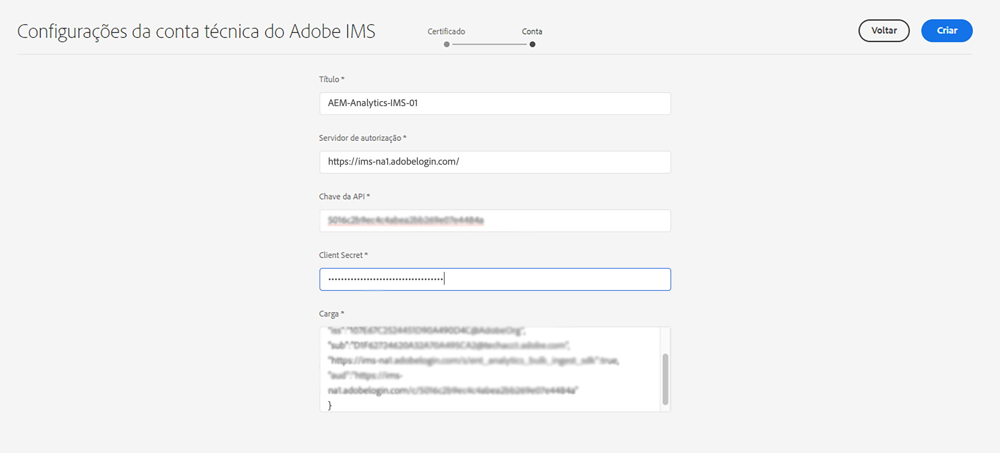
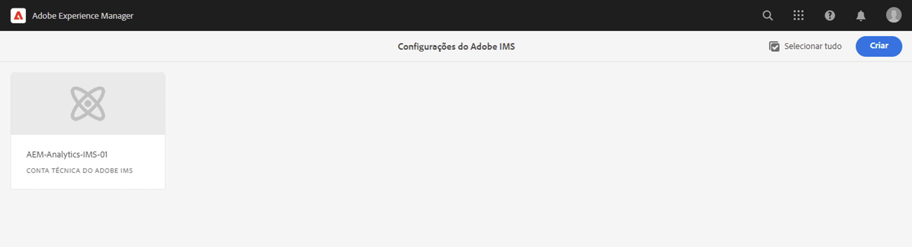

# Configuração do IMS para uso na integração com o Adobe Analytics {#ims-configuration-for-integration-with-adobe-analytics}

A integração do Adobe Experience Manager as a Cloud Service (AEMaaCS) com o Adobe Analytics, por meio da API do Analytics Standard, requer a configuração do Adobe IMS (Identity Management System). A configuração é realizada com o Adobe Developer Console.

>[!NOTE]
>
>A compatibilidade com a API 2.0 do Adobe Analytics Standard é nova no AEMaaCS 2022.2.0. Essa versão da API é compatível com a autenticação IMS.
>
>A seleção da API é orientada pelo método de autenticação usado para a integração do AEM/Analytics.
>
>Outras informações também estão disponíveis em [Migrar para as APIs 2.0](https://developer.adobe.com/analytics-apis/docs/2.0/guides/migration/).

## Pré-requisitos {#prerequisites}

Antes de iniciar este procedimento:

* O [Suporte da Adobe](https://helpx.adobe.com/br/contact/enterprise-support.ec.html) precisa provisionar sua conta com:

   * Adobe Console
   * Console do desenvolvedor da Adobe
   * Adobe Analytics e
   * Adobe IMS (Identity Management System)

* O administrador de sistemas da sua organização deve usar o Admin Console para adicionar os desenvolvedores necessários em sua organização aos perfis de produto relevantes.

   * Isso fornece aos desenvolvedores específicos permissões para ativar integrações usando o Adobe Developer Console.
   * Para obter mais detalhes, consulte [Gerenciar desenvolvedores](https://helpx.adobe.com/br/enterprise/admin-guide.html/enterprise/using/manage-developers.ug.html).

## Configuração de IMS - Geração de uma Chave pública {#configuring-ims-generating-a-public-key}

O primeiro estágio da configuração é criar uma configuração do IMS no AEM e gerar a Chave pública.

1. No AEM, abra o menu **Ferramentas**.
1. Na seção **Segurança**, selecione **Configurações do Adobe IMS**.
1. Selecione **Criar** para abrir a **Configuração de conta técnica do Adobe IMS**.
1. Usando a lista suspensa em **Configuração na nuvem**, selecione **Adobe Analytics**.
1. Ative **Criar novo certificado** e insira um novo alias.
1. Confirme com **Criar certificado**.

   

1. Selecione **Baixar** (ou **Baixar chave pública**) para baixar o arquivo na unidade local, de modo que ele esteja pronto para uso ao [configurar o IMS para a integração do Adobe Analytics com o AEM](#configuring-ims-adobe-analytics-integration-with-aem).

   >[!CAUTION]
   >
   >Mantenha essa configuração aberta; ela será necessária novamente quando [Concluir a configuração do IMS no AEM](#completing-the-ims-configuration-in-aem).

   

## Configurar o IMS para integração do Adobe Analytics com o AEM {#configuring-ims-adobe-analytics-integration-with-aem}

Usando o Console do Desenvolvedor da Adobe, é necessário criar um Projeto (integração) com o Adobe Analytics (para o AEM usar) e, em seguida, atribuir os privilégios necessários.

### Criação do projeto {#creating-the-project}

Abra o Console do desenvolvedor da Adobe para criar um Projeto com o Adobe Analytics que o AEM usará:

1. Abra os projetos do Adobe Developer Console:

   [https://developer.adobe.com/console/projects](https://developer.adobe.com/console/projects)

1. Todos os projetos que você tiver serão mostrados. Selecione **Criar novo projeto** - a localização e utilização dependerão:

   * Se você ainda não tiver um projeto, **Criar novo projeto** está no centro, na parte inferior.
     
   * Caso já tenha projetos existentes, eles são listados e **Criar novo projeto** está no canto superior direito.
     

1. Selecione **Adicionar ao projeto**, seguido da **API**:

   

1. Selecione **Adobe Analytics** e, em seguida, **Próximo**:

   >[!NOTE]
   >
   >Se você estiver inscrito no Adobe Analytics, mas não o vir listado, verifique os [Pré-requisitos](#prerequisites).

   

1. Selecione **Conta de serviço (JWT)** como o tipo de autenticação e clique em **Próximo**:

   

1. **Faça upload da sua chave pública** e, quando terminar, clique em **Próximo**:

   Selecione 

1. Revise as credenciais e continue com **Próximo**:

   

1. Selecione os perfis de produto necessários e clique em **Salvar API configurada**:

   

1. A configuração é confirmada.

### Atribuir privilégios à integração {#assigning-privileges-to-the-integration}

Agora, você deve atribuir os privilégios necessários à integração:

1. Abra o Adobe **Admin Console**:

   * [https://adminconsole.adobe.com](https://adminconsole.adobe.com/)

1. Navegue até **Produtos** (barra de ferramentas superior) e, em seguida, selecione **Adobe Analytics - &lt;*your-tenant-id*>** (no painel esquerdo).
1. Selecione **Perfis de produto** e seu espaço de trabalho necessário na lista apresentada. Por exemplo, Espaço de trabalho padrão.
1. Selecione **Credenciais da API** e, em seguida, a configuração de integração necessária.
1. Selecione **Editor** como **Função do produto**, em vez de **Observador**.

## Detalhes armazenados para o projeto de integração do Adobe Developer Console {#details-stored-for-the-ims-integration-project}

No Console do desenvolvedor da Adobe - Projetos, você pode ver uma lista de todos os seus projetos de integração:

* [https://developer.adobe.com/console/projects](https://developer.adobe.com/console/projects)

Selecione uma entrada de projeto específica para mostrar mais detalhes sobre a configuração. Dentre elas:

* Visão geral do projeto
* Insights
* Credenciais
   * Conta de serviço (JWT)
      * Detalhes da credencial
      * Gerar JWT
* APIS
   * Por exemplo, Adobe Analytics

Você precisará de algumas delas para concluir a integração do Adobe Analytics no AEM com base no IMS.

## Concluir a configuração do IMS no AEM {#completing-the-ims-configuration-in-aem}

Ao retornar para o AEM, é possível concluir a configuração do IMS adicionando os valores necessários da integração do IMS para o Analytics:

1. Retorne à [Configuração do IMS aberta no AEM](#configuring-ims-generating-a-public-key).
1. Selecione **Próximo**.

1. Aqui, é possível usar os [detalhes da configuração do projeto no Console do Desenvolvedor da Adobe](#details-stored-for-the-ims-integration-project):

   * **Título**: seu texto.
   * **Servidor de autorização**: copie/cole essa informação da linha `aud` da seção **Carga** abaixo, por exemplo, `https://ims-na1.adobelogin.com` no exemplo abaixo
   * **Chave da API**: copie da seção **Credenciais** na [Visão geral do projeto](#details-stored-for-the-ims-integration-project)
   * **Segredo do cliente**: gere isso na [guia Segredo do cliente da seção Conta de serviço (JWT)](#details-stored-for-the-ims-integration-project) e copie
   * **Carga**: copie isso da [guia Gerar JWT da seção Conta de Serviço (JWT)](#details-stored-for-the-ims-integration-project)

   

1. Confirme com **Criar**.

1. Sua configuração do Adobe Analytics é mostrada no console AEM.

   

## Confirmação da configuração do IMS {#confirming-the-ims-configuration}

Para confirmar que a configuração está funcionando como esperado:

1. Abrir:

   * `https://localhost<port>/libs/cq/adobeims-configuration/content/configurations.html`

   Por exemplo:

   * `https://localhost:4502/libs/cq/adobeims-configuration/content/configurations.html`

1. Selecione sua configuração.
1. Selecione **Verificar integridade** na barra de ferramentas e, em seguida, **Verificar**.

   

1. Se for bem-sucedido, você verá uma mensagem de confirmação.

## Concluir a integração com o Adobe Analytics {#complete-the-integration-with-adobe-analytics}

Agora, você pode usar essa configuração do IMS para concluir a [integração com o Adobe Analytics](/help/sites-cloud/integrating/integrating-adobe-analytics.md).

<!--
## Configuring the Adobe Analytics Cloud Service {#configuring-the-adobe-analytics-cloud-service}

The configuration can now be referenced for a Cloud Service to use the Analytics Standard API:

1. Open the **Tools** menu. Then, within the **Cloud Services** section, select **Legacy Cloud Services**.
1. Scroll down to **Adobe Analytics** and select **Configure now**.

   The **Create Configuration** dialog will open.

1. Enter a **Title** and, if you want, a **Name** (if left blank, it is generated from the title).

   You can also select the required template (if more than one is available).

1. Confirm with **Create**.

   The **Edit Component** dialog will open.

1. Enter the details in the **Analytics Settings** tab:

    * **Authentication**: IMS

    * **IMS Configuration**: select the name of the IMS Configuration

1. Click **Connect to Analytics** to initialize the connection with Adobe Analytics.

   If the connection is successful, the message **Connection successful** is displayed.

1. Select **OK** on the message.

1. Complete other parameters as required, followed by **OK** on the dialog to confirm the configuration.

1. You can now proceed to [Adding an Analytics Framework](/help/sites-administering/adobeanalytics-connect.md) to configure parameters that are sent to Adobe Analytics. 
-->
