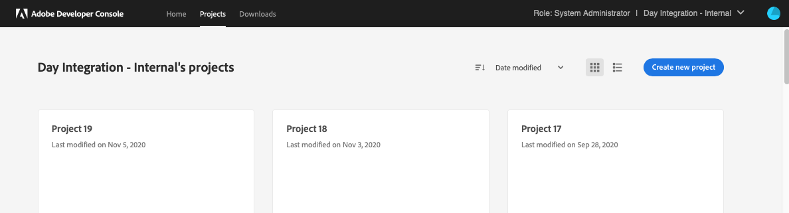
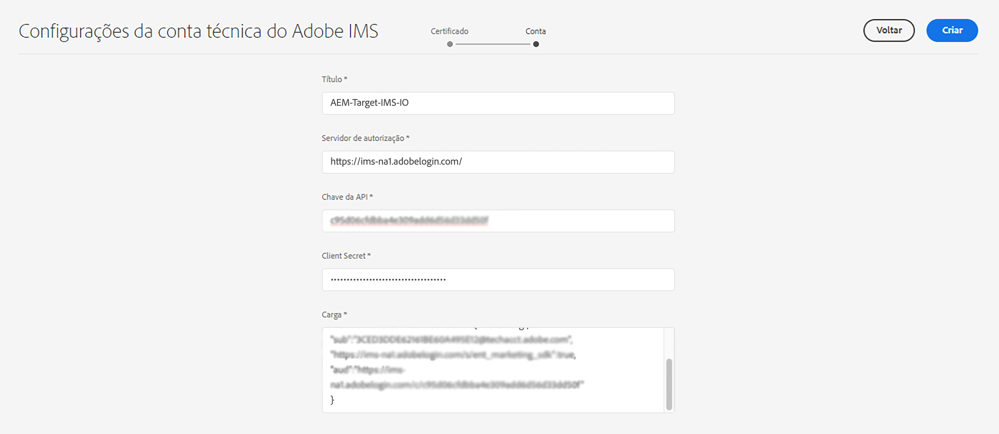

# Configuração do IMS para uso na integração com o Adobe Target{#ims-configuration-for-integration-with-adobe-target}

A integração do AEM com o Adobe Target por meio da API do Target Standard requer a configuração do Adobe IMS (Identity Management System). A configuração é realizada com o Adobe Developer Console.

>[!NOTE]
>
>A compatibilidade com a API do Adobe Target Standard é novidade no AEMaaCS. A API do Target Standard usa autenticação IMS.
>
>A seleção da API é orientada pelo método de autenticação usado para a integração do AEM/Target.

## Pré-requisitos {#prerequisites}

Antes de iniciar este procedimento:

* O [Suporte da Adobe](https://helpx.adobe.com/br/contact/enterprise-support.ec.html) precisa provisionar sua conta com:

   * Adobe Console
   * Console do desenvolvedor da Adobe
   * Adobe Target e
   * Adobe IMS (Identity Management System)

* O administrador de sistemas da sua organização deve usar o Admin Console para adicionar os desenvolvedores necessários em sua organização aos perfis de produto relevantes.

   * Isso fornece aos desenvolvedores específicos permissões para ativar integrações usando o Adobe Developer Console.
   * Consulte [Gerenciar desenvolvedores](https://helpx.adobe.com/br/enterprise/admin-guide.html/enterprise/using/manage-developers.ug.html).

## Configuração de IMS - Geração de uma Chave pública {#configuring-an-ims-configuration-generating-a-public-key}

O primeiro estágio da configuração é criar uma configuração do IMS no AEM e gerar a Chave pública.

1. No AEM, abra o menu **Ferramentas**.
1. Na seção **Segurança**, selecione **Configurações do Adobe IMS**.
1. Selecione **Criar** para abrir a **Configuração de contas técnicas do Adobe IMS**.
1. Usando a lista suspensa em **Configuração na nuvem**, selecione **Adobe Target**.
1. Ative **Criar novo certificado** e insira um novo alias.
1. Confirme com **Criar certificado**.

   

1. Selecione **Baixar** (ou **Baixar Chave pública**) para baixar o arquivo na unidade local, de modo que ele esteja pronto para uso ao [configurar o IMS para integração do Adobe Target com o AEM](#configuring-ims-adobe-target-integration-with-aem).

   >[!CAUTION]
   >
   >Mantenha essa janela de configuração aberta, pois ela será necessária novamente ao [concluir a configuração do IMS no AEM](#completing-the-ims-configuration-in-aem).

   

## Configuração do IMS para integração do Adobe Target com o AEM {#configuring-ims-adobe-target-integration-with-aem}

O projeto da integração do Adobe Developer Console com o Adobe Target que o AEM usará e, em seguida, atribuirá os privilégios necessários.

### Criação do projeto {#creating-the-project}

Abra o Adobe Developer Console para criar um Projeto com o Adobe Target que o AEM usará:

>[!CAUTION]
>
>Atualmente, só oferecemos suporte ao console do Adobe Developer **Conta de serviço (JWT)** tipo de credencial.
>
>Não use o **Servidor OAuth para servidor** tipo de credencial, que terá suporte no futuro.

1. Abra os projetos do Adobe Developer Console:

   [https://developer.adobe.com/console/projects](https://developer.adobe.com/console/projects)

1. Quaisquer projetos que você tiver serão mostrados. Selecione **Criar novo projeto** - a localização e utilização dependerão:

   * Se você ainda não tiver um projeto, **Criar novo projeto** estará na parte inferior central.
     
   * Caso já tenha projetos existentes, eles serão listados e **Criar novo projeto** estará no canto superior direito.
     

1. Selecione **Adicionar ao projeto** e, em seguida, **API**:

   

1. Selecione **Adobe Target** e, em seguida, **Próximo**:

   >[!NOTE]
   >
   >Se estiver inscrito no Adobe Target, mas ele não estiver listado, verifique os [Pré-requisitos](#prerequisites).

   

1. **Fazer upload de sua chave pública**, e quando terminar, continue com **Próximo**:

   Selecione 

1. Revise as credenciais e continue com **Próximo**:

   

1. Selecione os perfis de produto necessários e continue com **Salvar API configurada**:

   >[!NOTE]
   >
   >Os perfis de produto que são exibidos dependem se você:
   >
   >* Adobe Target Standard - somente o **Espaço de trabalho padrão** está disponível
   >* Adobe Target Premium - todos os espaços de trabalho disponíveis são listados, conforme mostrado abaixo

   

1. A criação é confirmada.

<!--
1. The creation is confirmed, you can now **Continue to integration details**; these are needed for [Completing the IMS Configuration in AEM](#completing-the-ims-configuration-in-aem).

   
-->

<!-- could not verify - only saw Adobe Target Classic -->

### Atribuir privilégios à integração {#assigning-privileges-to-the-integration}

Agora, você deve atribuir os privilégios necessários à integração:

1. Abra o Adobe **Admin Console**:

   * [https://adminconsole.adobe.com](https://adminconsole.adobe.com/)

1. Navegue até **Produtos** (barra de ferramentas superior) e, em seguida, selecione **Adobe Target - &lt;*seu-id-de-locatário*>** (no painel esquerdo).
1. Selecione **Perfis de produto** e, em seguida, o espaço de trabalho necessário. Por exemplo, Espaço de trabalho padrão.
1. Selecione **Credenciais da API** e, em seguida, a configuração de integração necessária.
1. Selecione **Editor** como **Função do produto**, em vez de **Observador**.

## Detalhes armazenados para o projeto de integração do Adobe Developer Console {#details-stored-for-the-ims-integration-project}

No console de Projetos do Adobe Developer Console, é possível ver uma lista de todos os projetos de integração:

* [https://developer.adobe.com/console/projects](https://developer.adobe.com/console/projects)

Selecione **Exibir** (à direita de uma entrada de projeto específica) para mostrar mais detalhes sobre a configuração. Dentre elas:

* Visão geral do projeto
* Insights
* Credenciais
   * Conta de serviço (JWT)
      * Detalhes da credencial
      * Gerar JWT
* APIS
   * Por exemplo, Adobe Target

Em alguns desses, você deve concluir a integração do Adobe Target no AEM com base no IMS.

## Concluir a configuração do IMS no AEM {#completing-the-ims-configuration-in-aem}

Ao retornar para o AEM, é possível concluir a configuração do IMS adicionando valores necessários da integração do IMS com o Target:

1. Retorne à [configuração do IMS aberta no AEM](#configuring-an-ims-configuration-generating-a-public-key).
1. Selecione **Próximo**.

1. Aqui você pode usar os [detalhes da configuração do projeto no Adobe Developer Console](#details-stored-for-the-ims-integration-project):

   * **Título**: seu texto.
   * **Servidor de autorização**: Copiar/colar isso da `aud` linha da seção de **Carga** abaixo, por exemplo, `https://ims-na1.adobelogin.com` no exemplo abaixo
   * **Chave da API**: copie isso da seção [Visão geral](#details-stored-for-the-ims-integration-project) do projeto
   * **Segredo do cliente**: gere isso na seção [Visão geral](#details-stored-for-the-ims-integration-project) do projeto e copie
   * **Carga**: copie isso da seção [Gerar JWT](#details-stored-for-the-ims-integration-project)

   

1. Confirme com **Criar**.

1. Sua configuração do Adobe Target será exibida no console do AEM.

   

## Confirmação da configuração do IMS {#confirming-the-ims-configuration}

Para confirmar que a configuração está funcionando como esperado:

1. Abrir:

   * `https://localhost<port>/libs/cq/adobeims-configuration/content/configurations.html`

   Por exemplo:

   * `https://localhost:4502/libs/cq/adobeims-configuration/content/configurations.html`

1. Selecione sua configuração.
1. Selecione **Verificar integridade** na barra de ferramentas, seguido por **Verificar**.

   

1. Se tiver êxito, você verá uma mensagem de confirmação.

## Concluir a integração com o Adobe Target {#complete-the-integration-with-adobe-target}

Agora é possível usar essa configuração do IMS para concluir a [integração com o Adobe Target](/help/sites-cloud/integrating/integrating-adobe-target.md).

<!--

## Configuring the Adobe Target Cloud Service {#configuring-the-adobe-target-cloud-service}

The configuration can now be referenced for a Cloud Service to use the Target Standard API:

1. Open the **Tools** menu. Then, within the **Cloud Services** section, select **Legacy Cloud Services**.
1. Scroll down to **Adobe Target** and select **Configure now**.

   The **Create Configuration** dialog opens.

1. Enter a **Title** and, if you want, a **Name** (if left blank it is generated from the title).

   You can also select the required template (if more than one is available).

1. Confirm with **Create**.

   The **Edit Component** dialog opens.

1. Enter the details in the **Adobe Target Settings** tab:

    * **Authentication**: IMS

    * **Client Code**: See the [Tenant ID and Client Code](#tenant-client) section.

    * **Tenant ID**: the Adobe IMS Tenant ID. See also the [Tenant ID and Client Code](#tenant-client) section.

      >[!NOTE]
      >
      >For IMS, this value must be taken from Target itself. You can log into Target and extract the Tenant ID from the URL.
      >
      >For example, if the URL is:
      >
      >`https://experience.adobe.com/#/@yourtenantid/target/activities`
      >
      >Then you would use `yourtenantid`.

    * **IMS Configuration**: select the name of the IMS Configuration

    * **API Type**: REST

    * **A4T Analytics Cloud Configuration**: Select the Analytics cloud configuration that is used for target activity goals and metrics. You need this if you are using Adobe Analytics as the reporting source when targeting content.   

      <!--
      If you do not see your cloud configuration, see note in [Configuring A4T Analytics Cloud Configuration](/help/sites-administering/target-configuring.md#configuring-a-t-analytics-cloud-configuration).
      -- >

    * **Use accurate targeting**: By default this check box is selected. If selected, the cloud service configuration will wait for the context to load before loading content. See note that follows.

    * **Synchronize segments from Adobe Target**: Select this option to download segments that are defined in Target to use them in AEM. Select this option when the API Type property is REST, because inline segments are not supported and you always need to use segments from Target. (The AEM term of 'segment' is equivalent to the Target 'audience'.)

    * **Client library**: Select whether you want the AT.js client library, or mbox.js (deprecated).

    * **Use Tag Management System to deliver client library**: Use DTM (deprecated), Adobe Launch or any other tag management system.

    * **Custom AT.js**: Leave blank if you checked the Tag Management box or to use the default AT.js. Alternatively upload your custom AT.js. Only appears if you have selected AT.js.

   <!--
   >[!NOTE]
   >
   >[Configuration of a Cloud Service to use the Target Classic API](/help/sites-administering/target-configuring.md#manually-integrating-with-adobe-target) has been deprecated (uses the Adobe Recommendations Settings tab).
   -- >

1. Click **Connect to Adobe Target** to initialize the connection with Adobe Target.

   If the connection is successful, the message **Connection successful** is displayed.

1. Select **OK** on the message, followed by **OK** on the dialog to confirm the configuration.

1. You can now proceed to [Adding a Target Framework](/help/sites-administering/target-configuring.md#adding-a-target-framework) to configure ContextHub or ClientContext parameters that are sent to Target. Note this may not be required for exporting AEM Experience Fragments to Target.

### Tenant ID and Client Code {#tenant-client}

With [Adobe Experience Manager as a Cloud Service](/help/release-notes/release-notes-cloud/release-notes-current.md), the Client Code field had been added to the Target configuration window.

When configuring the Tenant ID and Client Code fields, be aware of that for most customers, the **Tenant ID** and the **Client Code** are the same. This means that both fields contain the same information and are identical. Make sure you enter the Tenant ID in both fields.

>[!NOTE]
>
>For legacy purposes, you can also enter different values in the Tenant ID and the Client Code fields.

In both cases, be aware that:

* By default, the Client Code (if added first) will also be automatically copied into the Tenant ID field.
* You have the option to change the default Tenant ID set.
* Accordingly, the backend calls to Target are based on the **Tenant ID** and the client side calls to Target are based on the **Client Code**.

As stated previously, the default case is the most common for AEM as a Cloud Service. Either way, make sure **both** fields contain the correct information depending on your requirements.

>[!NOTE]
>
> If you want to change an existing Target Configuration:
>
> 1. Re-enter the Tenant ID.
> 2. Re-connect to Target.
> 3. Save the configuration.
-->
