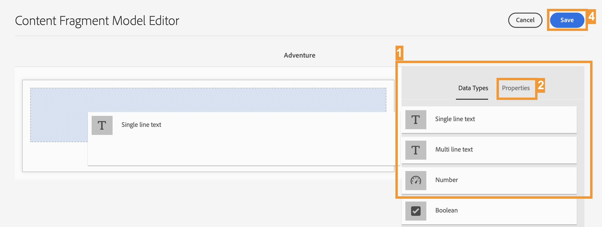

# Criar a estrutura de conteúdo do seu aplicativo {#content-structure}

>[!CONTEXTUALHELP]
>id="aemcloud_sites_trial_admin_content_fragments_overview"
>title="Criar a estrutura de conteúdo para seu aplicativo"
>abstract="Ao seguir essa série de guias interativos, você aprenderá a criar uma estrutura (conhecida como modelo de Fragmento de conteúdo) que serve como a estrutura fundamental para o seu conteúdo headless."

>[!CONTEXTUALHELP]
>id="aemcloud_sites_trial_admin_content_fragments_overview_guide"
>title="Iniciar o console de modelo"
>abstract="Vamos explorar como criar um esquema reutilizável, chamado de modelo de fragmento de conteúdo, para o seu conteúdo no Adobe Experience Manager as a Cloud Service. Assista ao vídeo para que você entenda por que essa etapa é importante.   Neste módulo de aprendizado, você usa um site de viagem como exemplo e aborda a criação de um modelo que representa uma viagem.  Inicie esse módulo em uma nova guia clicando no botão abaixo e, em seguida, siga este guia."
>additional-url="https://video.tv.adobe.com/v/3413261?captions=por_br" text="Vídeo de introdução à estrutura de conteúdo"

>[!CONTEXTUALHELP]
>id="aemcloud_sites_trial_admin_content_fragments_overview_guide_footer"
>title="Parabéns. Você aprendeu a criar um modelo de fragmento de conteúdo para representar a estrutura dos seus dados headless e deu o primeiro passo para fornecer conteúdo omnicanal de maneira dimensionada e padrão."
>abstract=""

## Criar um modelo {#create-model}

O console de modelos de fragmento de conteúdo é aberto em uma nova guia. Considere o console de modelos de Fragmento de conteúdo como a biblioteca de modelos, onde você cria modelos e gerencia modelos existentes.

Por exemplo, você cria um modelo que representa a estrutura de dados de uma viagem apresentada em um site de viagens. Um percurso usando esse modelo é chamado de **Aventura**.

1. No canto superior direito da tela, clique em **Criar** para começar a criar um modelo de Fragmento de conteúdo.

1. O assistente Criar modelo orienta você na criação do modelo. Forneça as informações obrigatórias.

   * **Título do modelo** - Uma etiqueta breve do modelo e geralmente indica a finalidade do modelo. Você pode chamar o novo modelo de `Adventure`.
   * **Ativar modelo**: essa opção está marcada por padrão e deve permanecer assim para que você possa criar fragmentos de conteúdo com base nesse modelo.

1. Depois que os campos obrigatórios forem preenchidos, clique em **Criar** no canto superior esquerdo para criar o modelo.

1. A variável **Sucesso** confirma que o modelo foi criado. Clique em **Abertura** na caixa de diálogo para que você possa abrir o novo Modelo de fragmento de conteúdo no editor em uma nova guia. Em seguida, continue com a próxima etapa para adicionar campos de dados ao modelo.

## Usar o Editor de modelos {#configure-model}

Agora você tem um modelo chamado **Aventura**, mas não tem detalhes como duração, destino e atividades. Antes de usar o modelo, é necessário definir a estrutura dos dados.

O editor de modelos de fragmento de conteúdo é onde você configura os tipos de dados e as propriedades que definem o conteúdo do modelo.

>[!TIP]
>
>É importante seguir os esquemas de nomenclatura nas instruções a seguir, pois esses nomes específicos são mencionados nos módulos posteriores.

1. Arraste um campo **Texto em linha única** do painel **Tipos de dados** à direita do editor e solte-o no modelo de fragmento de conteúdo.

1. Depois que um tipo de dados é colocado, a variável **Tipos de dados** coluna alterada automaticamente para **Propriedades** , na qual você pode definir os detalhes do tipo de dados inserido. Para este primeiro campo, você quer armazenar o título da viagem ou aventura. Insira as seguintes propriedades.

   * **Renderizar como:** **Campo de texto** - Quando você cria uma aventura, este campo armazena o título da aventura.
   * **Rótulo do campo:** `Title` - O rótulo exibido para esse campo ao criar uma aventura.

1. Depois de definir as propriedades do campo, você pode voltar para a **Tipos de dados** no painel direito e adicione campos adicionais arrastando e soltando.

Dessa forma, você pode adicionar quantos campos forem necessários ao modelo para suportar qualquer estrutura de dados necessária. Os tipos de campos de dados variam, mas o processo de adicioná-los ao modelo permanece o mesmo.

Prossiga para a próxima seção para adicionar os campos necessários para preencher e salvar a **Aventura** modelo

## Adicionar campos ao modelo {#additional-fields}

Já existe um campo para o título da aventura. Agora você deve adicionar campos para capturar a descrição, o preço e uma imagem representativa da aventura.

>[!TIP]
>
>O modelo **Aventura** é baseado no site de amostra do WKND para AEM. Você pode [acessar o site aqui](https://wknd.site/us/en/adventures/yosemite-backpacking.html) para ver o conteúdo que usa o modelo **Aventura**.

Siga as mesmas etapas descritas acima para acrescentar esses campos adicionais. A única diferença são as propriedades que devem ser definidas.

1. Adicione um campo para armazenar a descrição da aventura arrastando e soltando uma **Texto multilinha** e insira as seguintes propriedades:

   * **Renderizar como:** **Área de texto** - Quando você cria uma aventura, este campo armazena uma breve descrição da viagem.
   * **Rótulo do campo:** `Description` - O rótulo exibido para esse campo ao criar uma aventura.

1. Adicione um campo para poder armazenar o preço da aventura arrastando e soltando uma **Texto em linha única** e insira as seguintes propriedades:

   * **Renderizar como:** **Campo de texto** - Quando você cria uma aventura, este campo armazena o preço da viagem.
   * **Rótulo do campo:** `Price` - O rótulo exibido para esse campo ao criar uma aventura.

1. Adicione um campo para que você possa armazenar uma imagem que represente a viagem. As imagens no AEM são armazenadas como outro tipo de conteúdo chamado **Ativos**. Para criar um campo para eles, arraste e solte um **Referência de conteúdo** campo que faz referência ao ativo da imagem.

   * **Renderizar como:** **Referência de conteúdo** - Ao criar uma aventura, esse campo aponta para o ativo de imagem que representa essa viagem.
   * **Rótulo do campo:** `Image` - O rótulo exibido para esse campo ao criar uma aventura.

1. Depois de adicionar os campos necessários para o modelo de Fragmento de conteúdo, na parte superior direita da janela, clique em **Salvar**.

1. O modelo será salvo e você retornará ao console de modelos de fragmento de conteúdo.
