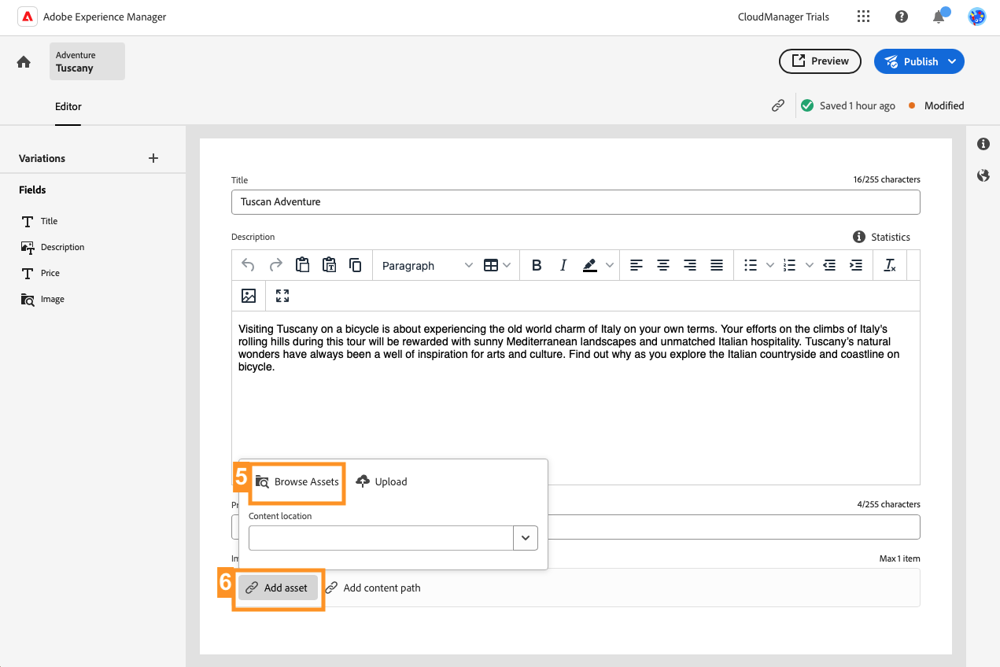

# Criar conteúdo headless {#create-content}

>[!CONTEXTUALHELP]
>id="aemcloud_sites_trial_admin_content_fragments_create_content"
>title="Criação de conteúdo headless"
>abstract="Usando o modelo criado no módulo anterior, você aprenderá a criar conteúdo que pode ser usado para a criação de páginas ou como a base do seu conteúdo headless."

>[!CONTEXTUALHELP]
>id="aemcloud_sites_trial_admin_content_fragments_create_content_guide"
>title="Iniciar o console de fragmentos de conteúdo"
>abstract="Criar um conteúdo consistente, de alta qualidade e que funciona perfeitamente em seus aplicativos e sites oferece excelentes experiências ao cliente. Esse módulo orienta você na criação do seu primeiro conteúdo headless usando o console Fragmento de conteúdo.<br><br>Inicie esse módulo em uma nova guia clicando no botão abaixo e, em seguida, siga este guia."

>[!CONTEXTUALHELP]
>id="aemcloud_sites_trial_admin_content_fragments_create_content_guide_footer"
>title="Excelente trabalho. Nesse módulo, você aprendeu a criar conteúdo headless como um fragmento de conteúdo com base no modelo criado anteriormente. Agora você sabe como as equipes de conteúdo podem criar e gerenciar conteúdo para aplicativos e sites, independentemente dos ciclos de desenvolvimento."
>abstract=""

## Criar um fragmento de conteúdo {#create-fragment}

Os fragmentos de conteúdo representam o conteúdo headless e são baseados em estruturas predefinidas, chamadas de modelos de fragmento de conteúdo. Você já criou um modelo em um módulo anterior.

Neste módulo, você cria um Fragmento de conteúdo com base nesse modelo usando o console de Fragmentos de conteúdo. Pense no console de fragmentos de conteúdo como uma biblioteca de conteúdo headless. Use-o para criar novos fragmentos de conteúdo e gerenciar fragmentos existentes.

O console de Fragmentos de conteúdo é usado para criar e editar conteúdo headless em canais de entrega e independentemente do contexto, que pode ser o método mais eficaz em muitos casos de criação. Em um módulo posterior, exploraremos a edição de conteúdo headless no contexto e no local.

1. Selecione o **Criar** na parte superior direita do console.

1. A variável **Novo fragmento de conteúdo** é aberta, onde você pode começar a criar um fragmento de conteúdo. O **Local** é automaticamente preenchido com a seção na qual o novo conteúdo será salvo.

1. No menu suspenso **Modelo de Fragmentos de conteúdo**, selecione o modelo de Fragmento de conteúdo **Aventura** criado anteriormente.

1. Adicione `Tuscany` como um **Título** descritivo para o fragmento de conteúdo. Isso é para identificar o seu fragmento no console.

1. Selecionar **Criar e abrir**.


>[!TIP]
>
>Dependendo das configurações do seu navegador, a nova guia do navegador pode ser suprimida por um bloqueador de pop-up. Se o novo fragmento não abrir depois de clicar em **Criar e abrir**, verifique as configurações do seu navegador.

## Adicionar conteúdo ao fragmento de conteúdo {#add-content}

Depois de salvar e abrir o novo fragmento de conteúdo, o editor de fragmentos de conteúdo será aberto em uma nova guia. Aqui, é possível adicionar o conteúdo do novo fragmento.

1. O editor de fragmentos de conteúdo mostra os campos definidos no modelo selecionado. Aqui, é possível adicionar conteúdo a cada campo para concluir o fragmento de conteúdo. Seu progresso é salvo automaticamente.

1. Forneça um **Título** para o fragmento, inserindo `Tuscan Adventure`.

1. Forneça uma **Descrição** para o fragmento colando o texto a seguir.

   ```text
   Visiting Tuscany on a bicycle is about experiencing the old world charm of Italy on your own terms. Your efforts on the climbs of Italy's rolling hills during this tour are rewarded with sunny Mediterranean landscapes and unmatched Italian hospitality. Tuscany's natural wonders have always been a well of inspiration for arts and culture. Find out why as you explore the Italian countryside and coastline on bicycle.
   ```

1. Forneça um **Preço** para o fragmento, inserindo `$700`.

1. Forneça uma **Imagem** que seja representativa da viagem tocando ou clicando em **Adicionar ativo** no campo **Imagem**.

1. Na janela pop-up de ativos, selecione **Procurar ativos** para selecionar de um ativo existente na biblioteca de ativos.

   

1. A caixa de diálogo **Selecionar ativo** será aberta. Usando o navegador em árvore no painel esquerdo, navegue até **Todos os ativos** > **aem-demo-assets** > **en** > **aventuras** > **cycling-tuscany**.

1. O conteúdo da pasta **cycling-tuscany** será exibido à direita. Selecione a imagem `ADOBESTOCK_141786166.JPEG`.

1. Selecionar **Selecionar**.

   

1. A imagem selecionada será mostrada no fragmento de conteúdo. O editor salvará as alterações automaticamente.

1. Quando terminar de adicionar o conteúdo, selecione o **Publish** na parte superior direita do editor. Isso disponibiliza o fragmento de conteúdo para ser consumido por aplicativos externos. Em seguida, selecione **Agora** no menu suspenso. Também é possível agendar sua publicação para um momento posterior.

   

1. A caixa de diálogo **Publicar fragmentos de conteúdo** será exibida. O AEM executa automaticamente uma verificação de referência para garantir que todos os recursos necessários sejam publicados para o fragmento de conteúdo. Nesse caso, também será necessário publicar o modelo criado. Selecionar **Publish**.

   

1. A publicação é confirmada em um banner.

Seu conteúdo foi publicado e está pronto para ser entregue ao seu aplicativo ou site como um fragmento de conteúdo.
