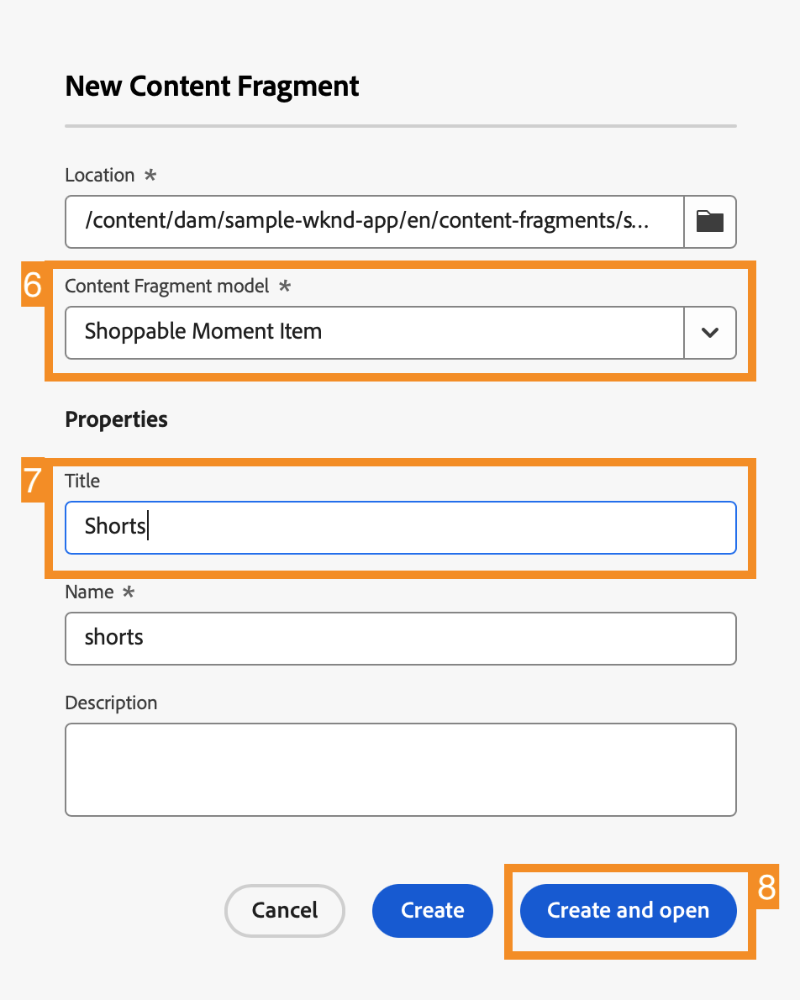

# Personalizar conteúdo em um aplicativo de exemplo do React {#customize-app}

>[!CONTEXTUALHELP]
>id="aemcloud_sites_trial_admin_content_fragments_react_app"
>title="Personalizar conteúdo em um aplicativo de exemplo do React"
>abstract="Sua avaliação do AEM Headless é integrada a um aplicativo de exemplo do React que pode ser personalizado."

>[!CONTEXTUALHELP]
>id="aemcloud_sites_trial_admin_content_fragments_react_app_guide"
>title="Iniciar o editor de fragmento de conteúdo"
>abstract="Agora vamos explorar como a criação de conteúdo headless funciona. Sua avaliação do AEM Headless é integrada a um aplicativo de exemplo do React, para que você possa ver como é fácil para qualquer pessoa gerenciar o conteúdo independentemente e sem tempo de desenvolvimento.  Inicie este módulo em uma nova guia clicando abaixo e, em seguida, siga este guia."

>[!CONTEXTUALHELP]
>id="aemcloud_sites_trial_admin_content_fragments_react_app_guide_footer"
>title="Neste módulo, você aprendeu a personalizar um aplicativo de exemplo do React.  Prazo para comercialização: acelerado. Ciclos de desenvolvimento: reduzidos.  Agora você sabe como é fácil gerenciar conteúdo headless para sites e aplicativos viabilizados pelos recursos headless do AEM."
>abstract=""

## Visualizar o aplicativo {#preview}

Você inicia no editor de fragmento de conteúdo com o aplicativo de exemplo fornecido com a avaliação do AEM Headless já carregado. O aplicativo de exemplo é viabilizado por fragmentos de conteúdo fornecidos por meio do GraphQL. Use o editor de fragmento de conteúdo para se familiarizar com o editor, visualizando o aplicativo de exemplo.

1. Toque ou clique no botão **Visualizar** na parte superior direita da tela do editor.

1. O aplicativo de demonstração é aberto em uma nova guia. O aplicativo é para uma marca fictícia de estilo de vida ao ar livre: WKND. Role para baixo na página para navegar pelo conteúdo de amostra.

1. Retorne à guia do navegador do editor de fragmento de conteúdo para continuar.

## Editar um cabeçalho no aplicativo {#edit-app}

O editor de fragmento de conteúdo exibe o layout básico do aplicativo como um fragmento de conteúdo da página. Os **Painéis** representam páginas diferentes do aplicativo, cada uma com seu próprio fragmento de conteúdo. Ao modificar esses fragmentos, você pode alterar o conteúdo do aplicativo.

1. Toque ou clique em **Ciclista de montanha no cânion** na seção **Painéis**.

   

1. O editor abre o painel de cabeçalho do aplicativo para o ciclista de montanha. Cada painel é composto de camadas, representando imagens e textos diferentes que compõem a experiência.

1. Selecione a **Camada de texto Ciclista de montanha no cânion** para exibir os detalhes da camada no editor. A camada é composta de vários fragmentos de conteúdo que controlam o texto exibido neste painel do aplicativo.

1. Selecione o item de texto **Título Ciclista de montanha no cânion**. Isso abre o editor de fragmento de conteúdo, exibindo o conteúdo desse fragmento e permitindo modificá-lo.

1. Altere o texto de `Your next great adventure is calling` para `Choose your own adventure`. A alteração é salva automaticamente pelo editor.

1. Toque ou clique em **Visualizar** na parte superior direita da janela para ver as alterações. A visualização do aplicativo de demonstração é aberta em uma nova guia.

   

Atualizar o conteúdo de um aplicativo do React quando ele está integrado ao CMS do AEM Headless é simples assim.

## Trocar uma imagem no aplicativo {#change-image}

Agora que você modificou um título no aplicativo, tente alterar uma imagem.

1. A partir da visualização, retorne à guia do navegador do editor de fragmento de conteúdo.

1. Você precisa retornar ao local correto no editor de fragmento de conteúdo. A barra de navegação estrutural no canto superior esquerdo do editor mostra onde você está na hierarquia de conteúdo. Toque ou clique em **Ciclista de montanha no cânion** na navegação estrutural para retornar à essa página.

   

1. Selecione a camada de imagem **Ciclismo de montanha - Ciclista**. Isso abre o editor de fragmento de conteúdo

1. Toque ou clique no **X** para remover a imagem do ciclista. A imagem desaparece e o editor mostra um erro, pois a imagem é um dado obrigatório para este modelo de fragmento de conteúdo.

   

1. Toque ou clique em **Adicionar ativo**.

1. A caixa de diálogo **Selecionar ativo** é aberta e o caminho **sample-wknd-app** > **en** > **image-files** é automaticamente selecionado para você.

1. Selecione a imagem `biker-yellow.png` e toque ou clique em **Selecionar**.

1. A imagem do ciclista é substituída pela imagem selecionada. O editor salva as alterações automaticamente.

1. Toque ou clique em **Visualizar** na parte superior direita da janela para ver as alterações. A visualização do aplicativo de demonstração é aberta em uma nova guia. Clique em atualizar no navegador e você deverá ver uma nova imagem de um ciclista com shorts amarelos no aplicativo.

Atualizar imagens e ativos em seus aplicativos com o CMS do AEM Headless é simples assim.

## Adicionar uma referência a um novo fragmento de conteúdo no aplicativo {#create-moment}

Agora que você atualizou a imagem do ciclista, vamos analisar como adicionar um novo conteúdo a um aplicativo criando e referenciando um novo fragmento de conteúdo. Você adicionará uma chamada de produto gerenciada por um fragmento de conteúdo de “momento de compra” ao segundo painel do aplicativo.

1. Da guia de visualização, retorne à guia do navegador do editor de fragmento de conteúdo.

1. Você precisa retornar ao local correto no editor de fragmento de conteúdo. A barra de navegação estrutural no canto superior esquerdo do editor mostra onde você está na hierarquia de conteúdo. Toque ou clique em **Página inicial WKND** na navegação estrutural para retornar a essa página.

1. Selecione o painel **Ciclista de montanha em WKND Amarelo**.

1. Selecione a camada **Ciclismo de montanha - Comprável**.

1. Para criar uma nova chamada neste painel, você deve criar um novo Fragmento de conteúdo do momento que pode ser comprado. Toque ou clique no botão **+ Criar novo fragmento**.

   

1. Primeiro, você deve escolher um modelo no qual basear o novo fragmento de conteúdo. Selecione o modelo **Item de momento de compra** na lista suspensa **Modelo do fragmento de conteúdo**.

1. Nomeie o fragmento de conteúdo. Por exemplo, insira `Shorts` no campo **Nome**.

1. Toque ou clique em **Criar e abrir**.

   

1. O editor é aberto para o novo fragmento de conteúdo.

1. Nomeie o momento de compra no campo **Texto**; por exemplo: `Yellow shorts`.

1. Defina valores para **X** e **Y**. É aqui que essa chamada deve ser sobreposta ao painel. As alterações no fragmento são salvas automaticamente pelo editor

   * **X**: `-5`
   * **Y**: `-10`

1. Toque ou clique em **Visualizar** na parte superior direita da janela para ver as alterações. A visualização do aplicativo de demonstração é aberta em uma nova guia. Clique em atualizar no navegador para testar o posicionamento e fazer ajustes no editor, conforme necessário.

   

Agora você sabe como criar um novo conteúdo, e referenciá-lo como um fragmento de conteúdo no aplicativo pode ser feito sem ciclos de desenvolvimento.
