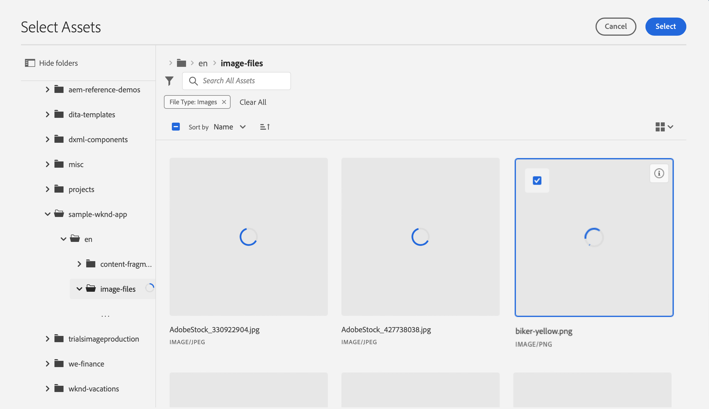
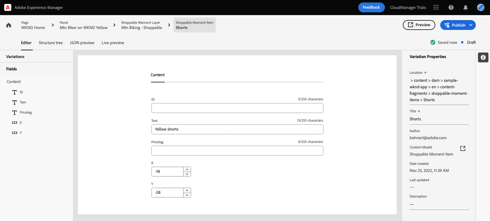

# Personalizar conteúdo em um aplicativo de amostra do React {#customize-app}

AEM as provas para headless são pré-carregadas com um aplicativo React simples para mostrar conteúdo headless. Neste módulo, você aprenderá a visualizar esse aplicativo e modificar seu conteúdo trocando uma imagem e criando um momento que pode ser comprado para ele.

O próprio aplicativo é baseado na estrutura dos Fragmentos de conteúdo. Usando o editor de Fragmento de conteúdo no AEM, é possível modificar o conteúdo dos aplicativos. Para ajudá-lo a entender como isso é feito, este módulo de Ensaios de AEM o orienta pelo processo com um tour interativo e rápido. Este documento constitui um complemento da viagem interativa, que cobre as mesmas etapas e se vincula aos recursos adicionais, se for caso disso.

## Editor de fragmento de conteúdo {#fragment-editor}

Você começa no editor de Fragmento de conteúdo para o aplicativo de amostra.

Se você quiser navegar até o editor de Fragmento de conteúdo , fora da orientação no aplicativo, ele será encontrado usando o ícone Adobe no canto superior esquerdo da página. Isso abre a navegação global do AEM. Aqui, você escolhe o **Navegação** e depois **Fragmentos de conteúdo**.

Isso abre o console Fragmento de conteúdo . A partir daí, você usa a árvore de conteúdo no painel esquerdo para navegar até o local do conteúdo do aplicativo. Neste caso, ao abrigo do **Fragmentos de conteúdo** -> **Exemplo de aplicativo WKND** -> **Inglês** -> **Fragmentos de conteúdo** -> **páginas**.

Toque ou clique no botão **WKND Home** fragmento de página exibido no console à direita da árvore de conteúdo para iniciar o editor do conteúdo do aplicativo.

>[!TIP]
>
>Se você quiser saber mais sobre navegação no AEM, consulte o [Seção Recursos adicionais](#additional-resources) deste documento para obter mais informações sobre AEM manuseio básico.

## Visualizar o aplicativo {#preview}

Antes de começar a modificar o aplicativo, primeiro familiarize-se com ele visualizando seu estado atual. Toque ou clique no botão **Visualizar** na parte superior direita da tela do editor.

O aplicativo de demonstração é aberto em uma nova guia.

O aplicativo em si é um aplicativo de comércio eletrônico simples para a marca fictícia WKND outdoors implementada no React. Clique em para navegar pelo conteúdo de amostra.

Retorne à guia do editor Fragmento de conteúdo para continuar.

## Editar texto no aplicativo {#edit-app}

Como mencionado anteriormente, o próprio aplicativo é composto de Fragmentos de conteúdo. Esses fragmentos são vinculados em uma estrutura para criar o aplicativo.

O editor de Fragmento de conteúdo exibe o layout básico do aplicativo como uma página. Esta página é um Fragmento de conteúdo, que por sua vez é uma coleção de outros fragmentos. O **Painéis** representam páginas diferentes do aplicativo, cada uma com seu próprio Fragmento de conteúdo. Ao modificar esses fragmentos, você pode alterar o conteúdo do aplicativo.

1. Toque ou clique **Mtn Biker em Canyon** no **Painéis** seção.

   

1. O editor abre o painel de cabeçalho do motociclista. Cada painel é composto de camadas, representando um conteúdo diferente em uma página do aplicativo.

   

1. Selecionar a camada de texto **Mtn Biker na Camada de Texto do Canyon**. Isso abre o detalhe da camada no editor. A camada é composta de vários Fragmentos do conteúdo.

   

1. Selecione o **Mtn Biker no Título do Canyon** item de texto. Isso abre o editor de Fragmento de conteúdo, mostrando o conteúdo desse fragmento e permitindo modificá-lo.

   

1. Alterar o texto de `Your next great adventure is calling` para `Choose your own adventure`. A alteração é salva automaticamente pelo editor.

1. Clique em visualizar para ver as alterações. O aplicativo de demonstração é aberto em uma nova guia.

   

Retorne à guia do editor Fragmento de conteúdo para continuar o módulo.

## Alterar a imagem principal do aplicativo {#change-image}

Agora que você modificou algum texto no aplicativo, tente alterar a imagem principal do aplicativo. Primeiro, você precisará localizar esse conteúdo.

As navegações estruturais no canto superior esquerdo do editor mostram onde você está na hierarquia de conteúdo.

1. Toque ou clique **Mtn Biker em Canyon** na navegação estrutural para retornar a essa página.

   

1. Retorne ao painel com as várias camadas do aplicativo. As camadas não representam apenas o conteúdo de texto. Eles representam todo o conteúdo do aplicativo. Portanto, também é possível trocar imagens usando o editor Fragmento de conteúdo .

   

1. Selecione o **Mtn Biking - Biker** camada da imagem. Isso abre o editor de Fragmento de conteúdo, mostrando o conteúdo desse fragmento e permitindo modificá-lo.

   

1. Toque ou clique no botão **X** para remover a imagem do biker. A imagem desaparece e o editor mostra um erro, pois a imagem é um dado necessário para esse modelo de Fragmento de conteúdo.

   

1. Toque ou clique **Adicionar ativo** e localize a imagem do biker amarelo em **sample-wknd-app** > **en** > **image-files**. Use a visualização de árvore no lado esquerdo do **Selecionar ativos** para navegar na hierarquia do conteúdo.

   

1. Filtro para o texto `yellow`. Use o **Pesquisar todos os ativos** na parte superior do **Selecionar ativos** para procurar a imagem. Insira o texto da pesquisa e pressione Enter ou return to search (voltar para pesquisar).

   

1. Toque ou clique para selecionar a variável `biker-yellow.png` imagem, em seguida, toque ou clique **Selecionar**.

   

1. A imagem do biker foi substituída pela imagem selecionada. O editor salva as alterações automaticamente.

   

## Criar um momento que pode ser comprado {#create-moment}

Agora que você atualizou a imagem do ciclista, você pode adicionar um momento que pode ser comprado para os shorts amarelos do ciclista.

1. Comece retornando ao editor de Fragmento de conteúdo para o fragmento da página. As navegações estruturais no canto superior esquerdo do editor mostram onde você está na hierarquia de conteúdo. Toque ou clique **WKND Home** na navegação estrutural para retornar a essa página.

   

1. Selecione o **Mtn Biker em WKND Yellow** painel.

   

1. Agora você pode ver as camadas que compõem a imagem do ciclista. Adicione um momento que pode ser comprado aos shorts amarelos do ciclista selecionando o **Mtn Biking - Comprável** camada.

   

1. Para criar um momento que pode ser comprado, você deve criar um novo Fragmento do conteúdo que represente esse momento. Toque ou clique no botão **+ Criar novo fragmento** botão para adicionar um momento que pode ser comprado para os shorts do motoqueiro.

   

1. Como os Fragmentos de conteúdo representam dados estruturados sem cabeçalho, sempre que você cria um Fragmento de conteúdo, primeiro deve escolher um modelo no qual basear ele. Selecione o **Item de Momento Comprável** do **Modelo do fragmento de conteúdo** lista suspensa.

   

1. Dê um nome ao Fragmento do conteúdo que representará esse novo momento que pode ser comprado. Por exemplo, insira `Shorts` na **Nome** campo.

   

1. Toque ou clique **Criar e abrir**.

1. O editor é aberto para o novo Fragmento do conteúdo.
   * Dê um nome ao momento que pode ser comprado na **Texto** como `Yellow shorts`.
   * Defina um X e um Y, o local onde esse momento que pode ser comprado deve ser sobreposto.
      * **X**: `-18`
      * **Y**: `-28`
   * As alterações no fragmento são salvas automaticamente pelo editor

   

1. Toque ou clique **Visualizar** para testar esse posicionamento e fazer ajustes conforme necessário.

   

## Você aprendeu a personalizar uma amostra de aplicativo React! {#conclusion}

Neste módulo, você aprendeu a personalizar uma amostra de aplicativo React. Primeiro aprendeu a editar o texto existente. Em seguida, uma imagem foi trocada por outra instância dessa imagem. Por fim, você viu como um item de momento que pode ser comprado é criado e posicionado.

Certifique-se de fazer check-out do [Seção Recursos adicionais](#additional-resources) para obter recursos adicionais sobre como usar o AEM e seus Fragmentos de conteúdo.

Se você quiser saber como os Fragmentos de conteúdo e o conteúdo sem periféricos são criados para consumo por aplicativos personalizados, pode começar revisando o módulo [Crie a estrutura de conteúdo para seu aplicativo.](content-structure.md)

Você pode retornar à sua tela inicial de avaliação clicando em **Soluções** botão na parte superior direita da barra de navegação e selecionando **Experience Manager**.

## Recursos adicionais {#additional-resources}

Para obter mais informações sobre Fragmentos de conteúdo e AEM, considere revisar esta documentação adicional.

* [Modelos de fragmentos do conteúdo](/help/assets/content-fragments/content-fragments-models.md) - Documentação completa sobre modelos de Fragmento de conteúdo
* [Fragmentos de conteúdo](/help/assets/content-fragments/content-fragments.md) - Visão geral dos fragmentos de conteúdo e links para concluir a documentação sobre os fragmentos de conteúdo
* [Manuseio básico](/help/sites-cloud/authoring/getting-started/basic-handling.md) - Documentação sobre como navegar e usar AEM para novos usuários
