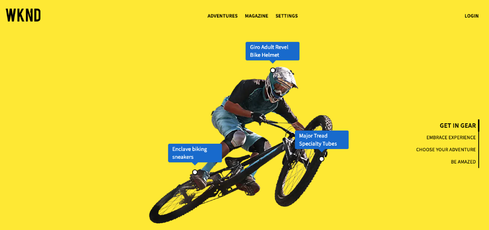

# Personalizar conteúdo em um aplicativo de amostra do React {#customize-app}

>[!CONTEXTUALHELP]
>id="aemcloud_sites_trial_admin_content_fragments_react_app"
>title="Personalizar conteúdo em um aplicativo React de amostra"
>abstract="Sua avaliação sem cabeçalho de AEM é integrada a um aplicativo React de amostra, que pode ser personalizado."

>[!CONTEXTUALHELP]
>id="aemcloud_sites_trial_admin_content_fragments_react_app_guide"
>title="Iniciar o editor de Fragmento de conteúdo"
>abstract="Sua avaliação sem periféricos de AEM vem integrada a um aplicativo React de amostra, para que você possa ver como é fácil para qualquer pessoa gerenciar o conteúdo independentemente sem tempo de desenvolvimento.  Inicie este módulo em uma nova guia clicando em abaixo e siga este guia."

>[!CONTEXTUALHELP]
>id="aemcloud_sites_trial_admin_content_fragments_react_app_guide_footer"
>title="Neste módulo, você aprendeu a personalizar uma amostra de aplicativo React.  Hora de comercialização: Acelerado! Ciclos de desenvolvimento: Reduzido!  Agora você entende como é fácil gerenciar conteúdo sem periféricos para sites e aplicativos alimentados por recursos sem periféricos AEM."
>abstract=""

## Visualizar o aplicativo {#preview}

Você inicia no editor Fragmento de conteúdo com o aplicativo de amostra fornecido com a avaliação sem cabeçalho AEM já carregada. O aplicativo de amostra é alimentado por Fragmentos de conteúdo fornecidos pelo GraphQL. Use o editor Fragmento de conteúdo para se familiarizar com o editor, visualizando o aplicativo de amostra.

1. Toque ou clique no botão **Visualizar** na parte superior direita da tela do editor.

1. O aplicativo de demonstração é aberto em uma nova guia. O aplicativo é para a ficcional marca de estilo de vida ao ar livre da WKND. Clique em para navegar pelo conteúdo de amostra.

1. Retorne à guia do navegador do editor Fragmento de conteúdo para continuar.

## Editar um cabeçalho no aplicativo {#edit-app}

O editor Fragmento de conteúdo exibe o layout básico do aplicativo como um Fragmento de conteúdo da página. O **Painéis** representam páginas diferentes do aplicativo, cada uma com seu próprio Fragmento de conteúdo. Ao modificar esses fragmentos, você pode alterar o conteúdo do aplicativo.

1. Toque ou clique **Mtn Biker em Canyon** no **Painéis** seção.

   

1. O editor abre o painel de cabeçalho do aplicativo para o construtor de montanha. Cada painel é composto de camadas, representando imagens e texto diferentes que compõem a experiência.

1. Selecionar a camada de texto **Mtn Biker na Camada de Texto do Canyon** para abrir o detalhe da camada no editor. A camada é composta de vários Fragmentos do conteúdo que controlam o texto exibido neste painel do aplicativo.

1. Selecione o **Mtn Biker no Título do Canyon** item de texto. Isso abre o editor de Fragmento de conteúdo, mostrando o conteúdo desse fragmento e permitindo modificá-lo.

1. Alterar o texto de `Your next great adventure is calling` para `Choose your own adventure`. A alteração é salva automaticamente pelo editor.

1. Toque ou clique **Visualizar** na parte superior direita da janela para ver as alterações. A visualização do aplicativo de demonstração é aberta em uma nova guia.

   

É assim que é fácil atualizar o conteúdo em um aplicativo React quando integrado AEM CMS sem periféricos.

## Trocar uma imagem no aplicativo {#change-image}

Agora que você modificou um título no aplicativo, tente alterar uma imagem.

1. Retorne à guia do navegador do editor Fragmento de conteúdo a partir da visualização.

1. Você precisa retornar ao local correto no editor Fragmento de conteúdo . As navegações estruturais no canto superior esquerdo do editor mostram onde você está na hierarquia de conteúdo. Toque ou clique **Mtn Biker em Canyon** na navegação estrutural para retornar a essa página.

   

1. Selecione o **Mtn Biking - Biker** camada da imagem. Isso abre o editor de Fragmento de conteúdo

1. Toque ou clique no botão **X** para remover a imagem do biker. A imagem desaparece e o editor mostra um erro, pois a imagem é um dado necessário para esse modelo de Fragmento de conteúdo.

   

1. Toque ou clique **Adicionar ativo**.

1. O **Selecionar ativo** é aberta e o caminho **sample-wknd-app** > **en** > **image-files** é automaticamente selecionado para você.

1. Selecione a imagem `biker-yellow.png` e toque ou clique em **Selecionar**.

1. A imagem do biker é substituída pela imagem selecionada. O editor salva as alterações automaticamente.

1. Toque ou clique **Visualizar** na parte superior direita da janela para ver as alterações. A visualização do aplicativo de demonstração é aberta em uma nova guia. Clique em atualizar no navegador e você deverá ver sua nova imagem de biker com shorts amarelos no aplicativo.

É fácil atualizar imagens e ativos em seus aplicativos com AEM CMS sem periféricos.

## Adicionar uma referência a um novo Fragmento do conteúdo no aplicativo {#create-moment}

Agora que você atualizou a imagem do biker, vamos analisar como adicionar novo conteúdo a um aplicativo criando e referenciando um novo Fragmento do conteúdo. Você adicionará uma chamada de produto gerenciada por um Fragmento de conteúdo de &quot;momento que pode ser comprado&quot; ao segundo painel do aplicativo.

1. Retorne à guia do navegador do editor Fragmento de conteúdo na guia pré-visualização.

1. Você precisa retornar ao local correto no editor Fragmento de conteúdo . As navegações estruturais no canto superior esquerdo do editor mostram onde você está na hierarquia de conteúdo. Toque ou clique **WKND Home** na navegação estrutural para retornar a essa página.

1. Selecione o **Mtn Biker em WKND Yellow** painel.

1. Selecione o **Mtn Biking - Comprável** camada.

1. Para criar uma nova chamada nesse painel, você deve criar um novo Fragmento de conteúdo de momento que pode ser comprado. Toque ou clique no botão **+ Criar novo fragmento** botão.

   

1. Primeiro, você deve escolher um modelo no qual basear o novo Fragmento de conteúdo. Selecione o **Item de Momento Comprável** do **Modelo do fragmento de conteúdo** lista suspensa.

1. Nomeie o Fragmento do conteúdo. Por exemplo, insira `Shorts` na **Nome** campo.

1. Toque ou clique **Criar e abrir**.

   

1. O editor é aberto para o novo Fragmento do conteúdo.

1. Dê um nome ao momento que pode ser comprado na **Texto** como `Yellow shorts`.

1. Definir valores para **X** e **Y**. É aqui que essa chamada deve ser sobreposta ao painel. As alterações no fragmento são salvas automaticamente pelo editor

   * **X**: `-5`
   * **Y**: `-10`

1. Toque ou clique **Visualizar** na parte superior direita da janela para ver as alterações. A visualização do aplicativo de demonstração é aberta em uma nova guia. Clique em atualizar no navegador para testar o posicionamento e fazer ajustes, conforme necessário, no editor.

   

Agora você sabe como criar novo conteúdo e referenciá-lo como um Fragmento de conteúdo no aplicativo podem ser concluídos sem ciclos de desenvolvimento.
