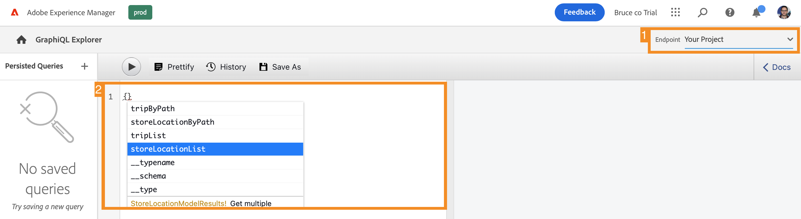

# Extrair conteúdo por meio da API do GraphQL {#extract-content}

>[!CONTEXTUALHELP]
>id="aemcloud_sites_trial_admin_content_fragments_graphql"
>title="Extrair conteúdo usando a API GraphQL"
>abstract="Neste módulo, você aprenderá a usar os Fragmentos de conteúdo e a API do GraphQL como um sistema de gerenciamento de conteúdo sem periféricos."

>[!CONTEXTUALHELP]
>id="aemcloud_sites_trial_admin_content_fragments_graphql_guide"
>title="Iniciar o GraphQL Explorer"
>abstract="O GraphQL fornece uma API baseada em query que permite que aplicativos clientes externos consultem AEM somente o conteúdo necessário, usando uma única chamada de API. Siga este módulo para saber como executar dois tipos diferentes de consultas. Em seguida, saiba como recuperar o conteúdo do Fragmento de conteúdo criado no módulo anterior.<br><br>Inicie esse módulo em uma nova guia clicando em abaixo."

>[!CONTEXTUALHELP]
>id="aemcloud_sites_trial_admin_content_fragments_graphql_guide_footer"
>title="Bom trabalho! Você aprendeu sobre os dois tipos básicos de consultas e como consultar seu próprio conteúdo. Agora você entende como usar a API AEM GraphQL para criar consultas eficientes que fornecem conteúdo em um formato que o aplicativo espera."
>abstract=""

## Consulta de uma lista de conteúdo de amostra {#list-query}

Você inicia no GraphQL Explorer em uma nova guia. Aqui, você pode criar e validar consultas contra seu conteúdo headless antes de usá-las para alimentar o conteúdo do seu aplicativo ou site.

1. Sua avaliação sem cabeçalho de AEM vem com um terminal pré-carregado com Fragmentos de conteúdo do qual você pode extrair conteúdo para fins de teste. Certifique-se de que a variável **Ativos de demonstração AEM** O endpoint é selecionado na variável **Endpoint** menu suspenso no canto superior direito do editor.

1. Copie o seguinte trecho de código para uma consulta de lista do pré-carregado **Ativos de demonstração AEM** endpoint . Um query de lista retorna uma lista de todo o conteúdo que usa um modelo de Fragmento de conteúdo específico. As páginas Inventário e categoria normalmente usam esse formato de consulta.

   ```text
   {
    adventureList {
     items {
       _path
       title
       price
       tripLength
       primaryImage {
         ... on ImageRef {
           _path
           mimeType
           width
           height
         }
       }
     }
    }
   }
   ```

1. Substitua o conteúdo existente no editor de consultas colando o código copiado.

1. Depois de colado, clique no botão **Reproduzir** na parte superior esquerda do Editor de consultas para executar a query.

1. Os resultados são exibidos no painel direito, ao lado do editor de query. Se a consulta estiver incorreta, um erro aparecerá no painel direito.

   

Você acabou de validar uma consulta de lista para obter uma lista completa de todos os Fragmentos de conteúdo. Esse processo ajuda a garantir que a resposta seja o que seu aplicativo espera, com resultados que ilustram como seus aplicativos e sites recuperarão o conteúdo criado no AEM.

## Consulta de uma parte específica do conteúdo de amostra {#bypath-query}

A execução de uma consulta byPath permite recuperar o conteúdo de um Fragmento de conteúdo específico. As páginas de detalhes do produto e as páginas que se concentram em um conjunto específico de conteúdo normalmente exigem esse tipo de consulta.

1. Copie o seguinte trecho de código para uma consulta byPath do pré-carregado **Ativos de demonstração AEM** endpoint .

   ```text
    {
     adventureByPath(
       _path: "/content/dam/aem-demo-assets/en/adventures/bali-surf-camp/bali-surf-camp"
     ) {
       item {
         _path
         title
         description {
           json
         }
         primaryImage {
           ... on ImageRef {
             _path
             width
             height
           }
         }
       }
     }
   }
   ```

1. Substitua o conteúdo existente no editor de consultas colando o código copiado.

1. Depois de colado, clique no botão **Reproduzir** na parte superior esquerda do Editor de consultas para executar a query.

1. Os resultados são exibidos no painel direito, ao lado do editor de query. Se a consulta estiver incorreta, um erro aparecerá no painel direito.

   

Você acabou de validar um query byPath para recuperar um Fragmento do conteúdo específico identificado pelo caminho desse fragmento.

## Consultar seu próprio conteúdo {#own-queries}

Agora que você executou os dois tipos principais de queries, está pronto para consultar seu próprio conteúdo.

1. Para executar consultas em relação aos seus próprios Fragmentos de conteúdo, altere o endpoint da variável **Ativos de demonstração AEM** para **Seu projeto** pasta.

1. Exclua todo o conteúdo existente no Editor de consultas. Em seguida, digite o colchete de abertura `{` e pressione Ctrl+Espaço ou Option+Espaço para obter uma lista de modelos de preenchimento automático que foram definidos no seu ponto de extremidade. Selecione o modelo criado que termina em `List` nas opções.

   

1. Defina os itens que a consulta deve conter para o modelo de Fragmento de conteúdo selecionado. Novamente, digite o colchete aberto `{`e pressione Ctrl+Espaço ou Opção+Espaço para obter uma lista de preenchimento automático. Selecionar `items` nas opções.

1. Toque ou clique no botão **Prettify** para formatar automaticamente seu código para facilitar a leitura.

1. Depois de concluir, toque ou clique no botão **Reproduzir** na parte superior esquerda do editor para executar a query. O editor preenche automaticamente o `items` e a consulta é executada.

1. Os resultados são exibidos no painel direito, ao lado do editor de query.

   

É assim que seu conteúdo pode ser entregue para experiências digitais omnicanais.
