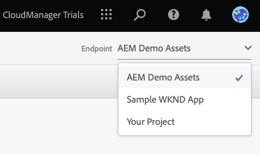
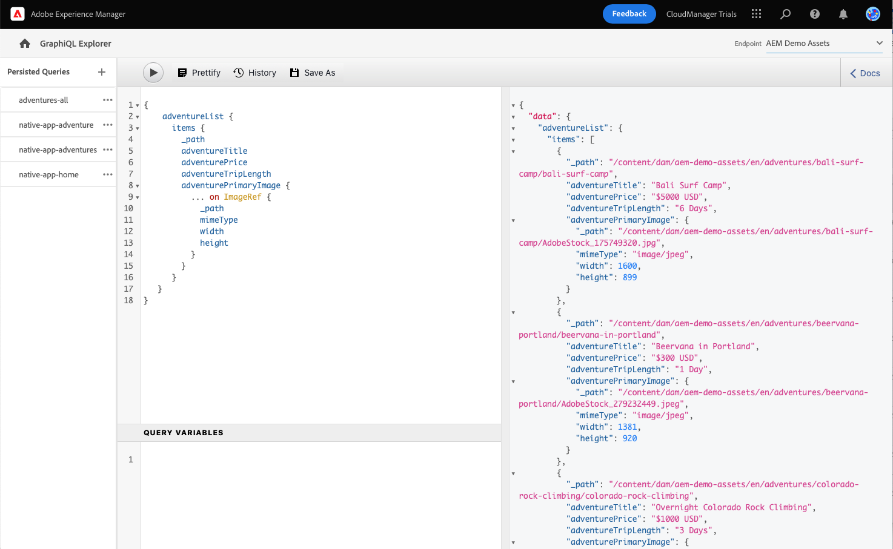
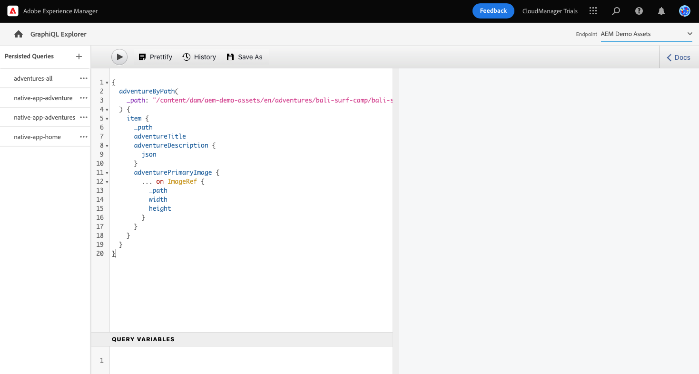

# Extrair conteúdo por meio da API GraphQL {#extract-content}

Até agora, em AEM de Julgamentos por impotência, você tem [criou seus próprios modelos de Fragmento de conteúdo](content-structure.md) além de criar seu próprio conteúdo sem periféricos [Fragmentos de conteúdo.](create-content.md) Agora você pode aprender a usar os Fragmentos de conteúdo e a API do GraphQL como um sistema de gerenciamento de conteúdo sem periféricos para fornecer seu conteúdo.

O GraphQL fornece uma API baseada em query que permite que aplicativos clientes externos consultem AEM somente o conteúdo necessário usando uma única chamada de API.

Primeiro, você aprenderá a executar dois tipos diferentes de consultas: **lista** e **byPath** consultas. Em seguida, você aprenderá a recuperar o conteúdo do Fragmento de conteúdo criado anteriormente. Este documento constitui um complemento da viagem interativa, que cobre as mesmas etapas e se vincula aos recursos adicionais, se for caso disso.

>[!TIP]
>
>Se desejar mais detalhes sobre a API do GraphQL, consulte a seção [Seção Recursos adicionais](#additional-resources) no final deste módulo para o guia da API do GraphQL.

>[!CONTEXTUALHELP]
>id="aemcloud_sites_trial_admin_content_fragments_graphql"
>title="Extrair conteúdo usando a API do GraphQL"
>abstract="Neste módulo, você aprenderá como usar Fragmentos de conteúdo e a API do GraphQL como um Sistema de gerenciamento de conteúdo sem cabeçalho."

>[!CONTEXTUALHELP]
>id="aemcloud_sites_trial_admin_content_fragments_graphql_guide"
>title="Iniciar o GraphQL Explorer"
>abstract="O GraphQL fornece uma API baseada em query que permite que aplicativos clientes externos consultem AEM somente o conteúdo necessário, usando uma única chamada de API. Siga este guia para saber como executar dois tipos diferentes de consultas e recuperar o conteúdo do fragmento de conteúdo criado em um módulo anterior.<br><br>Inicie o recurso em uma nova guia clicando em abaixo."
>additional-url="https://video.tv.adobe.com/v/328618" text="Espaço reservado do vídeo de introdução"

## GraphQL Explorer {#graphql-explorer}

Você inicia no GraphQL Explorer. Aqui você pode criar e executar consultas em relação ao seu conteúdo sem periféricos.


Se você quiser navegar até o GraphQL Explorer fora da orientação no aplicativo, ele será encontrado usando o ícone Adobe no canto superior esquerdo da página. Isso abre a navegação global do AEM. Aqui, você escolhe o **Ferramentas** e depois **Geral** -> **Editor de consultas GraphQL**.

>[!TIP]
>
>Se você quiser saber mais sobre navegação no AEM, consulte o [Seção Recursos adicionais](#additional-resources) deste documento para obter mais informações sobre AEM manuseio básico.

AEM as provas vêm com um terminal pré-carregado com conteúdo do qual você pode extrair conteúdo para fins de teste.



Selecione o **AEM ativos de demonstração** do **Endpoint** menu suspenso no canto superior direito do editor, se ainda não estiver configurado.

## Copiar e executar uma consulta de lista {#list-query}

Comece com uma consulta de lista simples para se orientar com o funcionamento das APIs GraphQL AEM as a Cloud Service. Este exemplo de consulta de lista retornará uma lista de todo o conteúdo que usa um modelo de Fragmento de conteúdo específico. As páginas Inventário e categoria normalmente usam esse formato de consulta.

1. Copie o trecho de código a seguir.

   ```text
   {
       adventureList {
         items {
            _path
            adventureTitle
            adventurePrice
            adventureTripLength
            adventurePrimaryImage {
              ... on ImageRef {
               _path
               mimeType
               width
               height
             }
           }
         }
      }
    }
   ```

1. Em seguida, substitua o conteúdo existente no editor de consultas colando o código copiado.

   

1. Depois de colado, clique no botão **Reproduzir** na parte superior esquerda do Editor de consultas para executar a query.

1. Depois que a query é executada com êxito, os resultados são exibidos no painel direito, ao lado do editor de query. Se a consulta estiver incorreta, um erro aparecerá no painel direito.

   

Você acabou de validar um query de lista para uma lista completa de todos os fragmentos de conteúdo. Esse processo ajuda a garantir que a resposta seja o que seu aplicativo espera, com resultados que ilustram como seus aplicativos e sites recuperarão o conteúdo criado no AEM.

Os diferentes canais e plataformas onde o conteúdo precisa ser exibido agora podem usar essa consulta ou semelhante para recuperar o conteúdo sem cabeçalho.

## Copiar e executar uma consulta do byPath {#bypath-query}

A execução de um query byPath permite recuperar ativos de um Fragmento de conteúdo específico. As páginas de detalhes do produto e as páginas que se concentram em um conjunto específico de conteúdo normalmente exigem esse tipo de consulta.

1. Copie o trecho de código a seguir.

   ```text
    {
     adventureByPath(
       _path: "/content/dam/aem-demo-assets/en/adventures/bali-surf-camp/bali-surf-camp"
     ) {
       item {
         _path
         adventureTitle
         adventureDescription {
           json
         }
         adventurePrimaryImage {
           ... on ImageRef {
             _path
             width
             height
           }
         }
       }
     }
   }
   ```

1. Em seguida, substitua o conteúdo existente no editor de consultas colando o código copiado.

   

1. Depois de colado, clique no botão **Reproduzir** na parte superior esquerda do Editor de consultas para executar a query.

1. Depois que a query é executada com êxito, os resultados são exibidos no painel direito, ao lado do editor de query. Se a consulta estiver incorreta, um erro aparecerá no painel direito.

1. Depois que a query é executada com êxito, os resultados são exibidos no painel direito, ao lado do editor de query. Se a consulta estiver incorreta, um erro aparecerá no painel direito.

   

Você acabou de validar um query de lista para uma lista completa de todos os fragmentos de conteúdo. Esse processo ajuda a garantir que a resposta seja o que seu aplicativo espera, com resultados que ilustram como seus aplicativos e sites recuperarão o conteúdo criado no AEM.

Os diferentes canais e plataformas onde o conteúdo precisa ser exibido agora podem usar essa consulta ou semelhante para recuperar o conteúdo sem cabeçalho.

## Execute consultas em seu próprio conteúdo {#own-queries}

Agora que você executou os dois tipos principais de queries, está pronto para configurar e executar queries para o conteúdo que você mesmo criou.

1. Para executar consultas em relação aos seus próprios Fragmentos de conteúdo, altere o endpoint da variável **Ativos de demonstração AEM** para **Seu projeto** pasta.

   

1. Comece selecionando e excluindo todo o conteúdo existente no Editor de consultas. Em seguida, digite o colchete de abertura `{` e pressione Ctrl+Espaço ou Opção+Espaço para obter uma lista de modelos que foram definidos no modelo do Fragmento de conteúdo. Selecione o modelo criado que termina em `List` na lista.

   

1. Defina os itens que a consulta deve conter para o modelo de fragmento de conteúdo selecionado. Novamente, digite o colchete aberto `{`e pressione Ctrl+Espaço ou Opção+Espaço para obter uma lista de preenchimento automático. Selecionar `items` na lista.

   

1. Defina os campos que a consulta deve conter para o modelo de fragmento de conteúdo selecionado. Novamente, digite o colchete aberto `{`e pressione Ctrl+Espaço ou Option+Espaço para obter uma lista de campos disponíveis no modelo de Fragmento de conteúdo. Selecione os campos que deseja do modelo na lista.

   

1. Delimite vários campos com uma vírgula (`,`) ou espaço e pressione Ctrl+Espaço ou Option+Espaço novamente para selecionar campos adicionais.

1. À medida que você trabalha, é possível tocar ou clicar no botão **Prettify** para formatar automaticamente seu código para facilitar a leitura.

   

1. Depois de concluir, toque ou clique no botão **Reproduzir** na parte superior esquerda do editor para executar a query.

   

É assim que seu conteúdo pode ser entregue para experiências digitais omnicanais. Consulte a [Seção Recursos adicionais](#additional-resources) para obter mais consultas de exemplo e saber o quanto você pode fazer com a API GraphQL.

## Você aprendeu a consultar conteúdo! {#conclusion}

Excelente trabalho! Você aprendeu sobre os dois tipos básicos de consultas e como consultar seu próprio conteúdo. Certifique-se de fazer check-out do [Seção Recursos adicionais](#additional-resources) para obter mais consultas de exemplo e saber o quanto você pode fazer com a API GraphQL.

Se você quiser saber como o conteúdo extraído é usado em um aplicativo React personalizado, revise o módulo [Personalizar conteúdo em um aplicativo de amostra do React.](customize-app.md)

Você pode retornar à sua tela inicial de avaliação clicando em **Soluções** botão na parte superior direita da barra de navegação e selecionando **Experience Manager**.


## Recursos adicionais {#additional-resources}

Para obter mais informações sobre Fragmentos de conteúdo e AEM, considere revisar esta documentação adicional.

* [O guia da API do GraphQL](https://experienceleague.adobe.com/docs/experience-manager-learn/getting-started-with-aem-headless/graphql/multi-step/explore-graphql-api.html)
* [Manuseio básico](/help/sites-cloud/authoring/getting-started/basic-handling.md) - Documentação sobre como navegar e usar AEM para novos usuários
* [Saiba como usar o GraphQL com o AEM - Exemplos de conteúdo e consultas](https://experienceleague.adobe.com/docs/experience-manager-cloud-service/content/headless/graphql-api/sample-queries.html)
