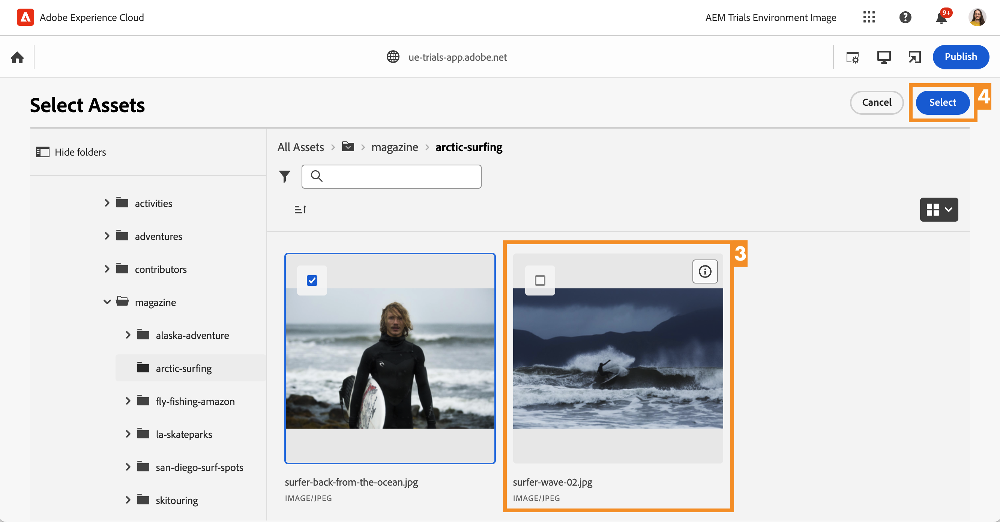
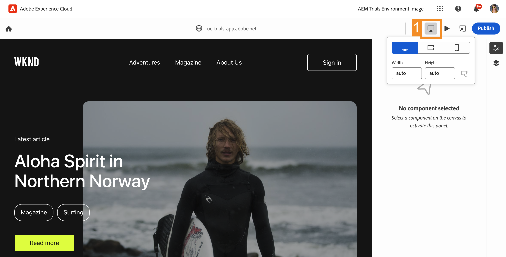

# Edição com contexto no Editor universal {#editing-in-context}

>[!CONTEXTUALHELP]
>id="aemcloud_sites_trial_edit_inline_universal_editor"
>title="Edição com contexto no Editor universal"
>abstract="Veja como seus aplicativos headless podem usar o Editor universal para trazer uma edição contextual e de baixo atrito ao alcance de seus autores."

>[!CONTEXTUALHELP]
>id="aemcloud_sites_trial_edit_inline_universal_editor_guide"
>title="Iniciar o Editor universal"
>abstract="Neste manual, exploraremos o Editor universal e como ele permite a qualquer pessoa editar cada aspecto de seu conteúdo em qualquer implementação, resultando em uma velocidade de conteúdo aprimorada.  Inicie este módulo em uma nova guia clicando abaixo e, em seguida, siga este guia."

>[!CONTEXTUALHELP]
>id="aemcloud_sites_trial_edit_inline_universal_editor_guide_footer"
>title="Neste módulo, você aprendeu a personalizar conteúdo para o contexto e local usando o Editor universal."
>abstract=""

## Editar texto no contexto {#edit-text}

A edição no local e no contexto geralmente pode ser vantajosa em relação à edição de conteúdo headless estruturado, como no editor de fragmento de conteúdo, que você viu nos módulos anteriores.

>[!NOTE]
>
>Para usar o Editor universal nesta versão de avaliação, você deve usar o Chrome como navegador e não no modo incógnito. Essa é uma limitação da experiência de avaliação, não do Editor universal.

Com o Editor universal, você tem uma maneira ágil de editar o texto no contexto e no local, permitindo a criação de conteúdo simples e intuitivo.

1. Clique duas vezes para selecionar o título do artigo mais recente e editá-lo.

   

1. O componente é selecionado conforme indicado por uma borda azul com uma guia indicando que é um componente de texto. Há um cursor na borda aguardando a entrada de texto. Altere o texto para `Aloha Spirit in Lofoten`.

   

1. Selecione fora do componente de texto e suas alterações serão salvas automaticamente.

O Editor universal salva as alterações automaticamente no ambiente de criação. Você ainda precisa publicá-las para que seus leitores vejam, o que faremos em uma etapa posterior.

## Editar mídia no contexto {#edit-media}

Você também pode trocar imagens enquanto ainda permanece no contexto do conteúdo usando o Editor universal.

1. Selecione a imagem do surfista para selecioná-la.

1. No painel de componentes, é possível ver os detalhes do ativo. Selecione a miniatura da **Imagem em destaque**.

   

1. Na janela **Selecionar ativos**, role a tela para baixo e selecione a imagem `surfer-wave-02.JPG` para selecioná-la.

1. Clique em **Selecionar** na janela **Selecionar ativos**.

   

A imagem é substituída pela que você selecionou.

## Experimente seu conteúdo como seus leitores {#emulators}

O Editor universal permite interagir com o conteúdo em seu contexto, vendo o conteúdo conforme é entregue aos dispositivos dos usuários.

1. Por padrão, o editor renderiza a versão para desktop do conteúdo. Selecione o botão Emulador na parte superior direita da barra de ferramentas do Editor universal para alterar o dispositivo de destino.

   

1. Os leitores podem estar em diferentes dispositivos com diferentes proporções, de modo que o editor oferece modos de emulação para ver como a página será apresentada aos usuários. Por exemplo, selecione a opção de dispositivo móvel no modo retrato.

   

1. Veja a alteração de conteúdo no editor. O ícone do emulador também muda para refletir o modo em que está. Selecione qualquer lugar fora do menu do emulador para fechá-lo e interagir com seu conteúdo.

1. Retorne o emulador ao modo desktop.

Você também pode especificar dimensões exatas para o emulador e girar o dispositivo emulado para exibir seu conteúdo em qualquer dispositivo de destino em potencial.

## Visualização e publicação {#preview}

Como é necessário selecionar o conteúdo para modificá-lo no editor, o editor não permite que você siga links ou interaja com o conteúdo tocando ou clicando. Usando o modo de visualização, você pode seguir os links no seu conteúdo e experimentá-lo como seus usuários fariam antes de publicar.

1. Na barra de ferramentas do Editor Universal, selecione **Visualizar**.

1. Agora selecione o link **Leia mais** para ver o artigo principal.

   

1. Procure o artigo e use o link **Voltar** para retornar à página principal.

   

1. Agora selecione o botão **Publicar** na parte superior direita do editor para publicar seu conteúdo.

   

Seu conteúdo foi publicado.

## Edição de fragmentos de conteúdo {#editing-fragments}

Para acelerar sua experiência de criação de conteúdo quando a edição estruturada de conteúdo headless for mais vantajosa do que a edição no local, o Editor universal também oferece acesso rápido ao editor de fragmento de conteúdo.

1. Desative o modo de visualização tocando no botão **Visualizar** na barra de ferramentas do Editor universal.

   

1. Role a página para baixo até a seção **Aventuras**.

1. Selecione uma das aventuras, como o **Campo de surfe de Bali**, para selecioná-la.

   * Observe o contorno azul do componente selecionado. A guia deve exibir o nome do fragmento de conteúdo quando um fragmento de conteúdo for selecionado. Neste caso, **Campo de surfe de Bali**.
   * Como o Editor universal permite selecionar qualquer objeto na página, os componentes que fazem parte de um fragmento de conteúdo também podem ser selecionados individualmente. Selecione onde indicado na ilustração para selecionar o componente inteiro do fragmento de conteúdo.

1. O ícone **Editar** aparece no painel de componentes. Selecione o ícone **Editar** para abrir o editor de fragmento de conteúdo em uma nova guia.

Na nova guia, agora é possível editar o fragmento de conteúdo selecionado no Editor universal.
